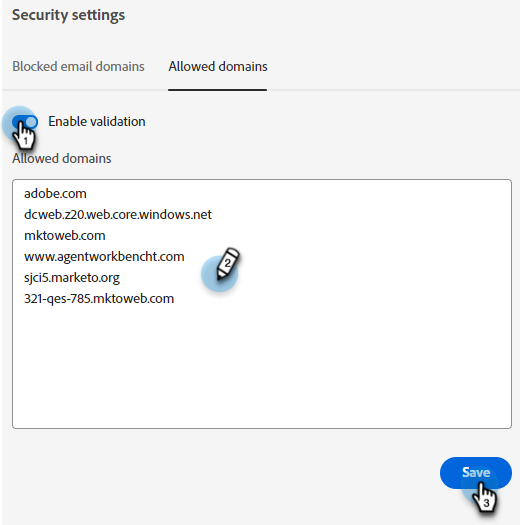

# Configurações de segurança {#security-settings}

Nas configurações de segurança, você pode adicionar domínios a uma lista de permissões ou bloqueada.

## Domínios de email bloqueados {#blocked-email-domains}

Incluir na lista de bloqueios Se houver visitantes com domínios de email com os quais você não deseja que seus agentes interajam (por exemplo, um concorrente), adicione o domínio de email deles à pesquisa.

1. Selecione o **Ativar validação** controle deslizante para ativar a inclui na lista de bloqueios. Insira até 50 domínios e clique em **Salvar**.

   

## Domínios permitidos {#allowed-domains}

A adição de domínios permitidos garante que terceiros não possam remover o javascript do seu site e adicioná-lo aos seus próprios.

1. Selecione o **Ativar validação** controle deslizante para ativar a inclui na lista de permissões. Insira os domínios permitidos e clique em **Salvar**.

   
