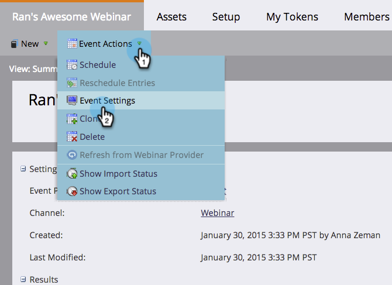
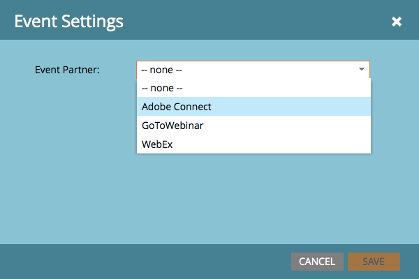

# Criar um evento com o Adobe Connect {#create-an-event-with-adobe-connect}

A sincronização com o Adobe Connect permite gerenciar o registro e a participação no webinário no Marketo, o que garante que o engajamento não fique sem rastreamento.

>[!PREREQUISITES]
>
>* [Vincular Adobe Connect e Marketo](/help/marketo/product-docs/administration/additional-integrations/add-adobe-connect-as-a-launchpoint-service.md)
>* [Criar um Novo Programa de Evento](/help/marketo/product-docs/demand-generation/events/understanding-events/create-a-new-event-program.md)

Primeiro, certifique-se de ter criado sua reunião ou seminário no Adobe Connect. Se precisar de ajuda, confira o [Guia do Usuário do Adobe Connect](https://help.adobe.com/en_US/connect/9.0/using/index.html).

As reuniões e os seminários criados no Adobe Connect devem ser criados na pasta especificada ao inserir suas credenciais no Marketo. Depois de criar a reunião ou seminário, anote todas as informações logísticas relevantes (como o número de telefone), a serem usadas no email de confirmação e no arquivo ICS.

>[!CAUTION]
>
>Como host do evento, certifique-se de ingressar de dentro do aplicativo e **não** pelo link enviado aos participantes.

>[!NOTE]
>
>No momento, não oferecemos suporte ao Adobe Connect no local.

1. Na página inicial de um novo evento, selecione **Ações de Evento** e depois **Configurações de Evento**.

   

   >[!NOTE]
   >
   >Se você não vir **Configurações de evento** na lista suspensa, verifique se o canal do evento tem **Evento com Webinar** selecionado em &quot;Aplica-se a.&quot;

1. Em **Parceiro de Evento**, selecione **Adobe Connect**.

   

1. Selecione sua ID de **Logon** e selecione seu **Evento**.

   

1. Clique em **Salvar**.

   

   Legal! Seu evento do Adobe Connect agora está sincronizado com seu evento do Marketo.

   >[!NOTE]
   >
   >Os campos que o Marketo envia são: Nome, Sobrenome, Endereço de email.

   >[!TIP]
   >
   >Para inserir a URL exclusiva da pessoa em um email, use este token: `{{member.webinar url}}`. Quando o email é enviado, esse token resolve automaticamente o URL de confirmação exclusivo da pessoa no Adobe Connect.
   >
   >Defina seu email de confirmação como **Operacional** para garantir que as pessoas que se registram e podem ter a assinatura cancelada ainda recebam suas informações de confirmação.

   As pessoas que se inscreverem no webinário serão encaminhadas ao provedor do webinário por meio da etapa de fluxo Alterar status do programa quando o Novo status for definido como &quot;Registrado&quot;. Nenhum outro status enviará a pessoa. Além disso, certifique-se de marcar a etapa de fluxo Alterar status do programa #1 e a etapa de fluxo Enviar email #2.

   

   >[!CAUTION]
   >
   >Evite usar programas de email aninhados para enviar emails de confirmação. Em vez disso, use a campanha inteligente do programa do evento, como mostrado acima.

   >[!TIP]
   >
   >Pode levar até 48 horas para que os dados sejam exibidos no Marketo. Se, após esse tempo de espera, você ainda não vir nada, selecione **Atualizar do Provedor de Webinar** no menu Ações de Evento, na guia Resumo do evento.

   >[!MORELIKETHIS]
   >
   >* [Adicionar o Adobe Connect as a LaunchPoint Service](/help/marketo/product-docs/administration/additional-integrations/add-adobe-connect-as-a-launchpoint-service.md)
   >* [Editar um canal de evento](/help/marketo/product-docs/demand-generation/events/understanding-events/edit-an-event-channel.md)
