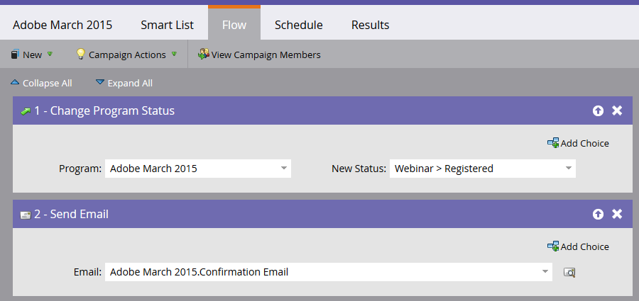

# Criar um Evento com o Adobe Connect {#create-an-event-with-adobe-connect}

A sincronização com a Adobe Connect permite gerenciar sua inscrição no webinar e presença dentro do Marketo, garantindo que o envolvimento não seja desacompanhado.

>[!PREREQUISITES]
>
>* [Vincular Adobe Connect e Marketo](/help/marketo/product-docs/administration/additional-integrations/add-adobe-connect-as-a-launchpoint-service.md)
>* [Criar um novo Programa de Evento](/help/marketo/product-docs/demand-generation/events/understanding-events/create-a-new-event-program.md)

Primeiro, certifique-se de ter criado sua reunião ou seminário no Adobe Connect. Se precisar de ajuda, confira o [Guia do Usuário do Adobe Connect](http://help.adobe.com/en_US/connect/9.0/using/index.html). As reuniões e os seminários criados no Adobe Connect devem ser criados na pasta especificada ao inserir suas credenciais no Marketo. Depois de criar a reunião ou seminário, anote quaisquer informações logísticas relevantes (como o número de telefone) para usar no email de confirmação e no arquivo ICS.

>[!NOTE]
>
>No momento, **não** oferecemos suporte ao Adobe Connect On-Site.

1. Na página inicial de um novo evento, selecione **Ações do Evento** e **Configurações do Evento**.

   

   >[!NOTE]
   >
   >Se você não vir **Configurações do Evento** no menu suspenso, verifique se o canal do evento tem **Evento com Webinar** selecionado em &quot;Aplica-se a&quot;.

1. Em **Parceiro de Evento**, selecione **Adobe Connect**.

   

1. Selecione sua ID de **Login** e selecione seu Evento **a3/>.**

   

1. Clique em **Salvar**.

   

   Legal! Seu evento Adobe Connect agora é sincronizado com seu evento Marketo.

   >[!NOTE]
   >
   >Os campos que o Marketo envia são: Nome, Sobrenome, Endereço de email.

   >[!TIP]
   >
   >Para inserir o URL exclusivo da pessoa em um email, use este token: `{{member.webinar url}}`. Quando o email é enviado, esse token resolve automaticamente o URL de confirmação exclusivo da pessoa da Adobe Connect.
   >
   >Defina seu e-mail de confirmação como **Operacional** para garantir que as pessoas que se registram e podem ser canceladas ainda recebam suas informações de confirmação.

   

   >[!CAUTION]
   >
   >Evite usar programas de e-mail aninhados para enviar seus e-mails de confirmação. Em vez disso, use a campanha inteligente do programa do evento, como mostrado acima.

   >[!TIP]
   >
   >Pode levar até 48 horas para que os dados apareçam no Marketo. Se, depois de aguardar tanto tempo, você ainda não vir nada, selecione **Atualizar do provedor de webinar** no menu Ações do Evento na guia Resumo do evento.

   >[!MORELIKETHIS]
   >
   > * [Adicionar Adobe Connect como um Serviço LaunchPoint](../../../../product-docs/administration/additional-integrations/add-adobe-connect-as-a-launchpoint-service.md)
   > * [Editar um Canal de Evento](../../../../product-docs/demand-generation/events/understanding-events/edit-an-event-channel.md)

As pessoas que se inscreverem no seu webinar serão encaminhadas para o seu provedor de webinar por meio da etapa de fluxo Alterar status do Programa quando o Novo status estiver definido como &quot;Registrado&quot;. Nenhum outro status empurrará a pessoa. Além disso, certifique-se de fazer a etapa 1 do fluxo Alterar status do Programa e a etapa 2 do fluxo de Enviar e-mail.
