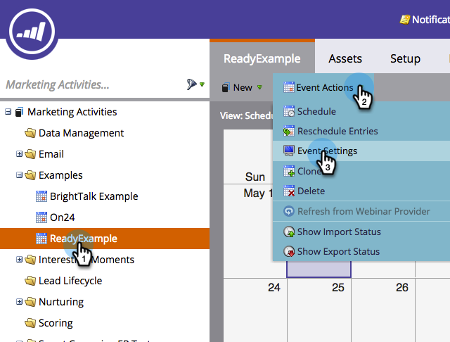
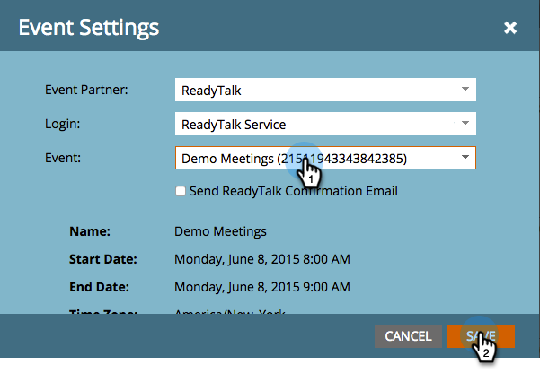

# Criar um Evento com o ReadyTalk {#create-an-event-with-readytalk}

>[!PREREQUISITES]
>
>* [Adicionar ReadyTalk como um Serviço LaunchPoint](/help/marketo/product-docs/administration/additional-integrations/add-readytalk-as-a-launchpoint-service.md)
>* [Criar um novo Programa de Evento](/help/marketo/product-docs/demand-generation/events/understanding-events/create-a-new-event-program.md)
>* Defina as ações de [fluxo apropriadas para](http://docs.marketo.com/display/DOCS/Flow+Actions)rastrear o envolvimento

Primeiro configure seu evento no centro de conferências ReadyTalk. Se precisar de ajuda, verifique o Centro de recursos do [ReadyTalk.](https://www.readytalk.com/resources/readytalk)  Ao escolher o tipo de registro, selecione **pré-registro antes da reunião**. Se você selecionar *registrar no momento da reunião*, o Marketo **não** capturará um status Registrado para seu pessoal e obterá somente um status de pessoa Participado *após* a conclusão do webinar.

Deixe desmarcada a **notificação de novos registros por email** .

Se estiver usando o ReadyTalk para enviar emails de confirmação, você também precisará adicionar uma descrição. Salve seu evento no ReadyTalk quando terminar.

>[!NOTE]
>
>Para agendar um Evento assistido por operador, clique no link **Solicitar serviços** de Evento localizado no lado esquerdo da tela inicial do Centro de conferências para agendar um evento com a nossa equipe de Eventos.

Agora você está pronto para vincular seu evento ao Marketo.

1. Selecione seu evento, clique em Ações **do** Evento e, por fim, em Configurações do **Evento.**

   

   >[!NOTE]
   >
   >O tipo de canal do evento selecionado deve ser **webinar.**

1. Em Parceiro **Evento,** selecione **ReadyTalk**.

   

1. Em **Logon,** selecione seu logon do ReadyTalk.

   

1. Em **Evento**, selecione o evento que deseja vincular e clique em **Salvar**.

   

   Legal! Seu evento agora está sincronizado.

   >[!NOTE]
   >
   >Os campos que o Marketo envia são: Nome, Sobrenome, Endereço de email.

   >[!TIP]
   >
   >Para preencher seu email de confirmação com este URL exclusivo, use o seguinte token no email: `{{member.webinar url}}`. Quando o URL de confirmação é enviado, esse token resolve automaticamente o URL de confirmação exclusivo da pessoa.
   >
   >Defina seu email de confirmação como Operacional para garantir que as pessoas que se registram, que podem ser canceladas, recebam suas informações de confirmação.

   

   >[!CAUTION]
   >
   >Evite usar programas de e-mail aninhados para enviar seus e-mails de confirmação. Em vez disso, use a campanha inteligente do programa do evento, como mostrado acima.

   >[!TIP]
   >
   >Pode levar até 48 horas para que os dados apareçam no Marketo. Se, depois de aguardar tanto tempo, você ainda não vir nada, selecione **Atualizar no provedor** de webinar no menu Ações do Evento na guia **Resumo** do evento.

## Exibindo a Programação  {#viewing-the-schedule}

Na visualização [do](http://docs.marketo.com/display/docs/program+schedule+view)cronograma do programa, clique na entrada do calendário do evento. Você pode ver o cronograma no lado direito da tela!

As pessoas que se inscreverem no seu webinar serão encaminhadas para o seu provedor de webinar por meio da etapa de fluxo Alterar status do Programa quando o Novo status estiver definido como &quot;Registrado&quot;. Nenhum outro status empurrará a pessoa. Além disso, certifique-se de fazer a etapa 1 do fluxo Alterar status do Programa e a etapa 2 do fluxo de Enviar e-mail.
