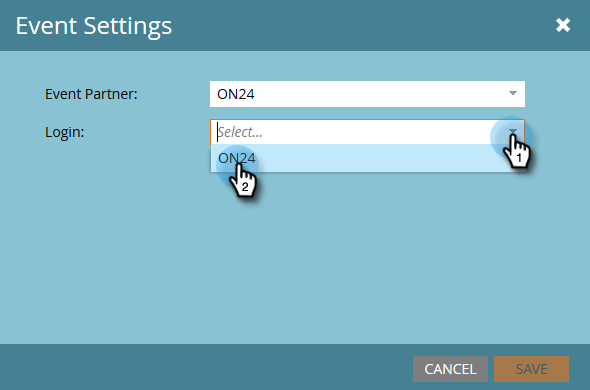

# Definir configurações de evento e sincronizar o Marketo com seu webinário {#configure-event-settings-and-sync-marketo-with-your-webinar}

Siga estas etapas para definir as configurações do evento do Marketo e conectar o Marketo e o ON24.

## Definir o evento {#set-the-event}

1. Escolha o evento que deseja associar a um webinário ON24, clique no menu suspenso **[!UICONTROL Ações de Evento]** e selecione **[!UICONTROL Configurações de Evento]**.

   

1. Selecione ON24 como o [!UICONTROL Parceiro de Evento].

   

1. Selecione a conta do [!UICONTROL Logon] (por exemplo, o nome para exibição).

   

1. Insira a [!UICONTROL Id do Evento] (obtenha isso do ON24). Clique em **[!UICONTROL Salvar]**.

   

   >[!NOTE]
   >
   >Durante os horários de pico, pode levar de 15 a 20 minutos para que o ON24 disponibilize as informações do Evento para o Marketo. Se você receber uma mensagem &quot;ID de sessão inválida&quot;, tente novamente um pouco mais tarde.

## Definir a programação {#set-the-schedule}

Quando você configura um evento associado a um Webinar do ON24, a programação de evento é preenchida com dados do ON24. Para acessar a caixa de diálogo [!UICONTROL Agendamento de Eventos], siga estas etapas.

1. Selecione o evento. Clique no menu suspenso **[!UICONTROL Ações de Evento]** e selecione **[!UICONTROL Agendar].**

   

1. Escolha sua **[!UICONTROL Data de Início]**, **[!UICONTROL Data de Término]** e **[!UICONTROL Fuso Horário]**. Clique em **[!UICONTROL Salvar]**.

   

   >[!NOTE]
   >
   >Se você atualizar qualquer informação de evento no ON24, deverá clicar em **[!UICONTROL Atualizar do Provedor de Webinar]** no menu [!UICONTROL Ações de Evento] para ver os novos dados preenchidos.

Agora você pode seguir para a próxima etapa: [criar campanhas filho e ativos locais](/help/marketo/product-docs/demand-generation/events/create-an-event/create-an-event-with-the-marketo-on24-adapter/create-child-campaigns-and-local-assets.md){target="_blank"}.

>[!MORELIKETHIS]
>
>[Noções Básicas sobre os Eventos do Adaptador Marketo On24](/help/marketo/product-docs/demand-generation/events/create-an-event/create-an-event-with-the-marketo-on24-adapter/understanding-marketo-on24-adapter-events.md){target="_blank"}
