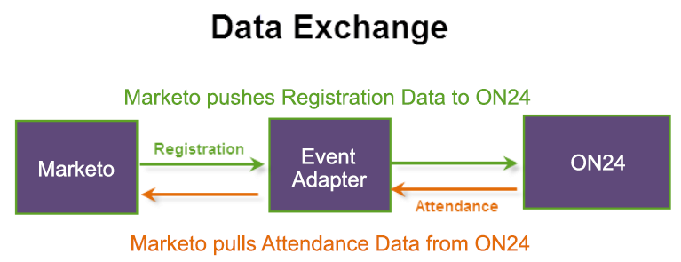

# Criar um evento no Marketo {#create-an-event-in-marketo}

Um evento do Marketo rastreia a progressão de seus funcionários em um programa. Ele envia informações de registro e obtém informações de presença usando o adaptador ON24. O evento captura o status das pessoas à medida que elas avançam por ele.

Veja como os dados são trocados:

Ao criar o evento do Marketo, selecione **Webinar** como o Tipo de canal. Você pode editar esse canal em Administração, bem como criar um novo canal. Se você criar um novo canal, ele deverá ser do tipo **Evento com Webinar** para que a integração funcione. Consulte [Criar um canal de programa](/help/marketo/product-docs/administration/tags/create-a-program-channel.md){target="_blank"} para obter mais informações.

A próxima etapa é [definir as configurações do evento e sincronizar o Marketo com o seu webinário](/help/marketo/product-docs/demand-generation/events/create-an-event/create-an-event-with-the-marketo-on24-adapter/configure-event-settings-and-sync-marketo-with-your-webinar.md){target="_blank"}.

>[!MORELIKETHIS]
>
>[Noções Básicas sobre os Eventos do Adaptador Marketo ON24](/help/marketo/product-docs/demand-generation/events/create-an-event/create-an-event-with-the-marketo-on24-adapter/understanding-marketo-on24-adapter-events.md){target="_blank"}
