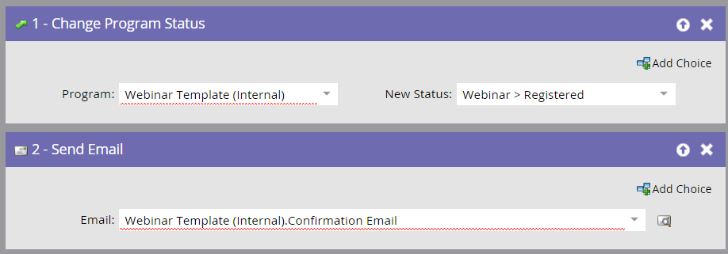

# Criar Campanhas secundárias e ativos locais {#create-child-campaigns-and-local-assets}

Crie campanhas secundárias e ativos locais usando o Design Studio.

## landing page e formulário {#landing-page-and-form}

Para garantir que as pessoas estejam registradas corretamente com ON24, os seguintes campos devem ser incluídos no formulário de marketing:

* Nome
* Sobrenome
* Endereço de email

Você também pode mover os seguintes campos para ON24:

* Nome da empresa
* Cargo

Com a etapa de fluxo adequada adicionada à campanha de registro, as pessoas serão encaminhadas para o ON24 e serão marcadas como registradas. É possível adicionar outros campos ao formulário e as informações serão capturadas no Marketo como parte do registro de detalhes da pessoa.

>[!CAUTION]
>
>Para uma integração bem-sucedida, é necessário usar um formulário Marketo para registrar as pessoas para o Evento ou um formulário que não seja de marketing com a integração de API adequada para enviar dados de registro para o Marketo.

## Emails e tokens de URL {#emails-and-url-tokens}

Crie o convite, a confirmação, o acompanhamento e os e-mails de agradecimento usando o Marketo.

## Email de confirmação de marketing e token de URL {#marketo-confirmation-email-and-url-token}

Use o Marketo para enviar o e-mail de confirmação para o seu evento. Quando uma pessoa se registra, recebe um URL exclusivo para usar para inserir o evento.

>[!NOTE]
>
>**Lembrete**
>
>Para preencher seu email de confirmação com este URL exclusivo, use o seguinte token no email: `{{member.webinar url}}`. Quando você envia o URL de confirmação, esse token resolve automaticamente o URL de confirmação exclusivo da pessoa.
>
>Defina o tipo de seu email de confirmação como **Operacional** para garantir que as pessoas que se registram recebam suas informações de confirmação, mesmo que elas não estejam assinadas.

>[!TIP]
>
>Você pode configurar o ON24 para enviar e-mails de confirmação, lembrete ou acompanhamento. Consulte o Site [de Ajuda do](http://webcastelitehelp.on24.com) ON24 para obter mais informações.

## Requisitos de Campanha para filho de inscrição {#registration-child-campaign-requirements}

Os eventos contêm uma ou mais campanhas secundárias que trabalham juntas para mover as pessoas pelos status dos programas e permitir que você acompanhe o desempenho dos eventos.

Exemplos de campanhas secundárias são uma campanha de convite, uma campanha de registro e campanhas de acompanhamento.

>[!CAUTION]
>
>Para que o adaptador faça seu trabalho, É NECESSÁRIO criar uma campanha de registro. Essa campanha deve ser acionada pela pessoa que preenche um formulário e a primeira etapa deve alterar o status do programa para **Registrado**. A campanha envia um email de confirmação. Consulte o restante deste artigo para obter detalhes.

**Registro/confirmação (Campanha do acionador)**

* Lista inteligente
* Acionador com base no formulário **** Preencher. Certifique-se de incluir a landing page em que o formulário permanece usando **Adicionar restrição**, especialmente se o mesmo formulário for usado em várias landings page.

>[!CAUTION]
>
>É necessário usar um formulário do Marketo para registrar as pessoas para o evento, ou um formulário que não seja do Marketing com a integração da API adequada para enviar dados de registro para o Marketo. Isso é fundamental para o sucesso da integração do parceiro de evento.

>[!NOTE]
>
>Se você estiver usando um formulário Marketo em uma landing page que não seja Marketo, seu acionador será **Preencher formulário** com o Nome do formulário.

**Fluxo**

* **Alterar status** do Programa - Definir como Webinar -> Registrado.

Esta etapa de fluxo é necessária como a PRIMEIRA ETAPA DE FLUXO ao configurar a campanha secundária. Quando o status do programa de uma pessoa muda para Registrado, Marketo envia as informações de registro para ON24. Nenhum outro status empurrará a pessoa.

* **Enviar e-mail** - e-mail de confirmação. Defina este email como **Operacional** para que as pessoas que se inscreveram ainda o recebam.

A etapa **Enviar fluxo de email** DEVE ser a segunda etapa. O e-mail de confirmação contém o `{{member.webinar url}}`, que é preenchido com informações enviadas de volta para o Marketo a partir do ON24.

>[!NOTE]
>
>A ordem dessas etapas de fluxo é importante devido à ordem em que as ações são executadas no Marketo. A etapa **Alterar status** do Programa envia a pessoa para ON24 para se registrar e um URL exclusivo é gerado. Depois que isso ocorrer, você poderá enviar o email de confirmação que inclui esse URL exclusivo usando o `{{member.webinar URL}}` token.
>
>Se a pessoa for devolvida com um erro de registro, ela não receberá a confirmação do email.

O próximo passo é [testar a integração](test-your-on24-event-integration.md)do evento ON24.

>[!MORELIKETHIS]
>
>* [Noções Gerais dos Eventos do adaptador do Marketo ON24](understanding-marketo-on24-adapter-events.md)
>* [Exemplo de integração de Evento ON24](example-on24-event-integration.md)
>* [Entendendo os status dos Programas do webinar](understanding-webinar-program-statuses.md)
>* [Teste sua integração de Evento ON24](test-your-on24-event-integration.md)

>

