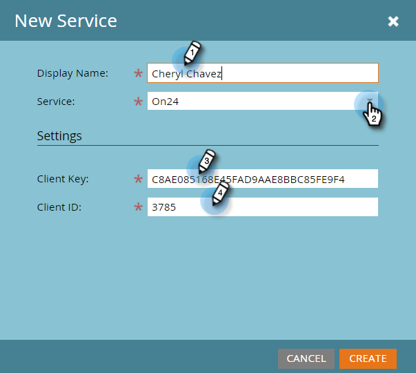
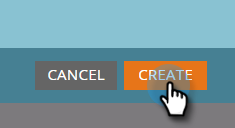

# Insira suas credenciais ON24 no Marketo {#enter-your-on-credentials-in-marketo}

Vamos começar com a integração do evento ON24. Se você precisar editar ou excluir suas credenciais, essas etapas também serão incluídas abaixo.

## Inserir credenciais {#enter-credentials}

1. Faça logon no Marketo e clique em **Admin**.

   

1. Em Integração, clique em **LaunchPoint**.

   

1. Em Serviços instalados, clique em **Novo** e, em seguida, em **Novo serviço**.

   

1. Na caixa de diálogo Novo serviço, digite estas informações:

   * **Nome** de exibição - insira um nome para uso no Marketo. Esse pode ser o seu nome ou o nome do seu grupo se você compartilhar credenciais.
   * **Serviço** - Selecione **On24** no menu suspenso.

   * **Chave** do cliente - insira a Chave do cliente ON24 que você usa para fazer logon. A chave do cliente é uma string de 32 dígitos contendo uma mistura de letras e números.
   * **ID** do cliente - insira a ID do cliente ON24 de 4 dígitos que você usa para fazer logon. Você pode obter a ID do cliente e a chave do cliente diretamente do seu Gerente de conta ON24.

   

1. Clique em **Criar**.

   

1. Quando as credenciais são validadas com êxito, elas são adicionadas à página Serviços instalados. Se houver um erro, você não poderá salvar as credenciais.

## Editar credenciais {#edit-credentials}

Você pode editar suas credenciais se sua senha expirar ou precisar fazer uma alteração em uma credencial existente.

1. Na guia Serviços instalados, selecione a credencial que deseja editar e clique em **Editar serviço**.

   

1. Atualize as informações na caixa de diálogo Editar serviço e clique em **Salvar**.

   

## Excluir um serviço {#delete-a-service}

1. Na guia Serviços instalados, selecione o serviço que deseja excluir, clique no menu suspenso Ações **** de serviço e selecione **Excluir serviço**.

   

1. Clique em **Excluir**.

   

O próximo passo é [criar seu evento webinar no ON24](create-your-webinar-event-in-on24.md).

>[!NOTE]
>
>**Artigos relacionados**
>
>* [Noções Gerais dos Eventos do adaptador do Marketo ON24](understanding-marketo-on24-adapter-events.md)

>

