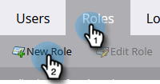

# Configurar a integração do ON24 com o Marketo{#set-up-the-on24-integration-with-marketo}

Veja como configurar sua integração de eventos ON24.

## Criar uma função somente API {#create-an-api-only-role}

1. Em Meu Marketo, clique em **[!UICONTROL Admin]**.

   

1. Em [!UICONTROL Segurança], clique em **[!UICONTROL Usuários e funções]**.

   

1. Clique na guia **[!UICONTROL Funções]** e depois em **[!UICONTROL Nova Função]**.

   

1. Insira um [!UICONTROL Nome da Função]. Abra o menu **[!UICONTROL Acessar API]** e selecione &quot;[!UICONTROL Objeto Personalizado de Leitura-Gravação]&quot; e &quot;[!UICONTROL Pessoa de Leitura-Gravação].&quot; Clique em **[!UICONTROL Criar]**.

   

## Criar um novo usuário {#create-a-new-user}

1. Ainda em [!UICONTROL Usuários e funções], clique na guia **[!UICONTROL Usuários]** e em **[!UICONTROL Convidar novo usuário]**.

   

1. Insira as informações do novo usuário e clique em **[!UICONTROL Avançar]**.

   

1. Selecione a Função somente API [!UICONTROL ON24 (todos os espaços de trabalho)] que você acabou de criar. Marque a caixa de seleção **[!UICONTROL Somente API]**. Clique em **[!UICONTROL Avançar]**.

   

1. Clique em **[!UICONTROL Enviar]**.

   

>[!NOTE]
>
>Um convite não é necessário para usuários somente API.

## Configurar conexão ON24 {#set-up-on24-connection}

1. Ainda na seção [!UICONTROL Admin], clique em **[!UICONTROL LaunchPoint]**.

   

1. Clique em **[!UICONTROL Novo]** e depois em **[!UICONTROL Novo serviço]**.

   

1. Escolha um [!UICONTROL nome para exibição]. Clique no menu suspenso **[!UICONTROL Serviço]** e selecione **[!UICONTROL Personalizado]**. Insira uma [!UICONTROL descrição]. Clique no menu suspenso [!UICONTROL Somente Usuário da API] e selecione o usuário que você criou [nas etapas acima](#create-a-new-user). Clique em **[!UICONTROL Criar]**.

   

1. Encontre o serviço [!DNL LaunchPoint] personalizado que você acabou de criar e clique em [!UICONTROL Exibir Detalhes].

   

1. Realce, clique com o botão direito do mouse, copie e salve a [!UICONTROL ID do cliente] (você precisará dela mais tarde). Repita para [!UICONTROL Client Secret].

   

1. Na árvore à esquerda, clique em **[!UICONTROL Serviços da Web]**.

   

1. Em &quot;[!UICONTROL REST API]&quot;, destaque, clique com o botão direito do mouse, copie e salve a primeira parte da [!UICONTROL Identidade] (até o &#39;m&#39; em .com).

   

1. Com a ID do cliente, o segredo do cliente e a identidade salvos, navegue até a conta do ON24. O restante das etapas são executadas lá e podem ser encontradas na [documentação do ON24](https://support.on24.com/hc/en-us/articles/21420762650523-Data-Integration-Setup-Instructions-When-Using-Marketo-Registration-Option-1){target="_blank"}.
