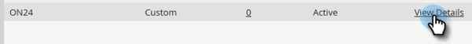

# Configurar a integração ON24 com o Marketo{#set-up-the-on24-integration-with-marketo}

Veja como configurar a integração de evento ON24.

## Criar uma função somente de API {#create-an-api-only-role}

1. Em Minha Marketo, clique em **Administrador**.

   

1. Em Segurança, clique em **Usuários e funções**.

   

1. Clique no botão **Funções** e depois **Nova função**.

   

1. Insira um Nome de função. Abra o **API de acesso** e selecione &quot;Read-Write Custom Object&quot; e &quot;Read-Write Person.&quot; Clique em **Criar**.

   

## Criar um novo usuário {#create-a-new-user}

1. Ainda em Usuários e funções, clique no botão **Usuários** e clique em **Convidar novo usuário**.

   

1. Insira as informações do novo usuário e clique em **Próximo**.

   

1. Selecione a função somente da API ON24 que você acabou de criar. Selecione o **Somente API** caixa de seleção. Clique em **Próximo**.

   

1. Clique em **Enviar**.

   

>[!NOTE]
>
>Um convite não é necessário para usuários Somente API.

## Configurar Ligação ON24 {#set-up-on24-connection}

1. Ainda na seção Admin , clique em **LaunchPoint**.

   

1. Clique em **Novo** then **Novo Serviço**.

   

1. Escolha um nome para exibição. Clique no botão **Serviço** e selecione **Personalizado**. Insira uma descrição. Clique no menu suspenso Somente usuário da API e selecione o usuário que você criou [nas etapas acima](#create-a-new-user). Clique em **Criar**.

   

1. Localize o serviço personalizado do LaunchPoint que você acabou de criar e clique em Exibir detalhes.

   

1. Realce, clique com o botão direito do mouse, copie e salve a ID do cliente (será necessário mais tarde). Repita para Segredo do cliente.

   

1. Na árvore à esquerda, clique em Serviços da Web.

   

1. Em &quot;REST API&quot;, destaque, clique com o botão direito do mouse, copie e salve a primeira parte da identidade (até o &#39;m&#39; em .com).

   

1. Com a ID do cliente, o Segredo do cliente e a Identidade salvos, navegue até a conta do ON24. O restante das etapas são executadas lá e são [descrito aqui](https://on24support.force.com/Support/s/article/Connect-Marketo-ON24-Connect-Data-Integration#Step6){target=&quot;_blank&quot;}.
