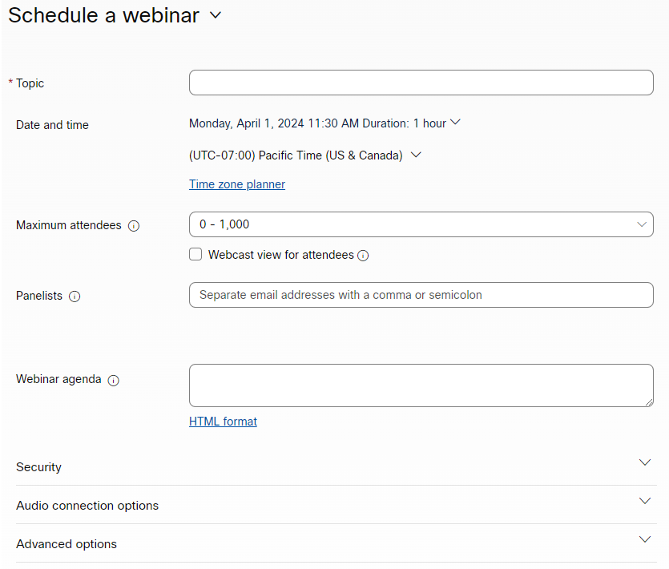

# Criar um evento com o Webex {#create-an-event-with-webex}

Depois de criar um webinário no Webex, será necessário sincronizar o evento com o Marketo Engage.

>[!PREREQUISITES]
>
>* [Adicionar o Webex como um serviço do LaunchPoint](/help/marketo/product-docs/administration/additional-integrations/add-webex-as-a-launchpoint-service.md)
>* [Criar um novo programa de evento](/help/marketo/product-docs/demand-generation/events/understanding-events/create-a-new-event-program.md)
>* Defina as [ações de fluxo](/help/marketo/product-docs/core-marketo-concepts/smart-campaigns/flow-actions/add-a-flow-step-to-a-smart-campaign.md) para rastrear o envolvimento

## Agendar Seu Webinário {#schedule-your-webinar}

Agende o evento e escolha as configurações de sua preferência no [Webex](https://www.webex.com/){target="_blank"}. Only the following information is viewable in Marketo: webinar name, start/end date & time, time zone, and description. Additional information about Webex Webinars [can be found here](https://help.webex.com/en-us/landing/ld-7srxjs-WebexWebinars/Webex-Webinars){target="_blank"}.

### Informações básicas {#basic-information}

* **Tópico**: Esse é o nome do evento e poderá ser visto no Marketo.
* **Data e hora**: data de início/término, hora de início/término, duração e fuso horário são visualizados no Marketo.
* **Máximo de participantes**: o número máximo de participantes determina quais recursos do Webex são compatíveis.
* **Exibição de webcast para participantes**: marque essa opção para que seu webinário seja transmitido ao vivo para todos os participantes.
* **Painelistas**: Convide pessoas específicas para serem membros do painel em seu webinário.
* **Agenda do webinário**: preencha esta opção se desejar fornecer contexto no convite enviado por email para as listas de painéis.

### Segurança {#security}

* **Senha do webinário**: (opcional) Se você usar esse campo, certifique-se de incluí-lo no email de confirmação.
* **Senha da lista de painéis**: (opcional) se você usar esse campo, certifique-se de incluí-lo na agenda do Webinário.
* **Exigir conta**: limita os participantes somente àqueles que têm contas do Webex.

### Opções de Conexão de Áudio {#audio-connection-options}

* **Tipo de conexão de áudio**: escolha como os participantes do webinário ingressam na parte de áudio do webinário.
* **Tom de entrada e saída**: selecione o som que você deseja que os usuários quando alguém entrar ou sair do webinário (é necessário uma conexão de áudio por telefone).
* **Ativar mudo da lista de painéis**: escolha as configurações de mudo da lista de painéis desejadas.

### Opções avançadas {#advanced-options}

* **Gravação automática**: marque essa opção para que seu webinário seja gravado automaticamente.
* **Sessão de prática**: marque essa opção para iniciar uma sessão de prática quando o webinário começar.
* **Sessões de debate**: as sessões de debate permitem que você atribua previamente os painéis e participantes antes do início do webinário ou permitem que eles participem durante o webinário.
* **Série de webinários**: adicionar a uma série de webinários permite que as pessoas vejam seu webinário, seja ele público ou não.
* **Registro**: exige que os participantes se registrem e recebam aprovação do host antes de participar.
* **Lembrete de email**: escolha um lembrete de email com duração de 15 minutos antes do início do webinário, até dois dias.
* **Opções de webinário**: determine quais recursos estão disponíveis para os participantes do webinário.
* **Privilégios do participante**: Os privilégios de participante determinam as ações disponíveis para os participantes do webinário.

>[!NOTE]
>
>A integração Marketo-Webex não oferece suporte ao envio de emails de confirmação do Webex. A confirmação deve ser enviada via Marketo. Depois de programar o evento, copie as informações do evento no email de confirmação do Marketo e defina o email como _Operacional_.

## Sincronizar o evento com o Marketo Engage {#sync-your-event-with-marketo-engage}

1. No Marketo, localize e selecione o Programa de evento desejado. No **Ações de evento** selecione **Configurações do evento**.

   

   >[!NOTE]
   >
   >O tipo de canal do evento selecionado deve ser **webinário**.

1. No **Parceiro de evento** selecione **Webex Webinars**.

   

1. No **Logon** selecione seu login do Webex.

   

1. No **Evento** escolha seu evento Webex.

   

1. Os detalhes do webinário serão preenchidos. Clique em **Salvar**.

   

Seu evento Webex agora está sincronizado com seu Programa de evento do Marketo. As pessoas que se inscreverem no seu webinário serão enviadas ao seu provedor de webinário por meio do _Alterar status do programa_ etapa do fluxo quando o novo status é definido como &quot;Registrado&quot;. Nenhum outro status enviará a pessoa. Certifique-se de _Alterar status do programa_ etapa de fluxo #1, e _Enviar e-mail_ etapa de fluxo #2.

## Itens a Observar {#things-to-note}

* Evite usar Programas de email aninhados para enviar emails de confirmação. Em vez disso, use a Campanha inteligente do programa de evento.

* Pode levar até 48 horas para que os dados sejam exibidos no Marketo. Se, após esse tempo de espera, você ainda não visualizar nada, clique em **Atualizar do provedor do webinário** no **Ações de evento** na lista suspensa **Resumo** do seu Programa de evento.
