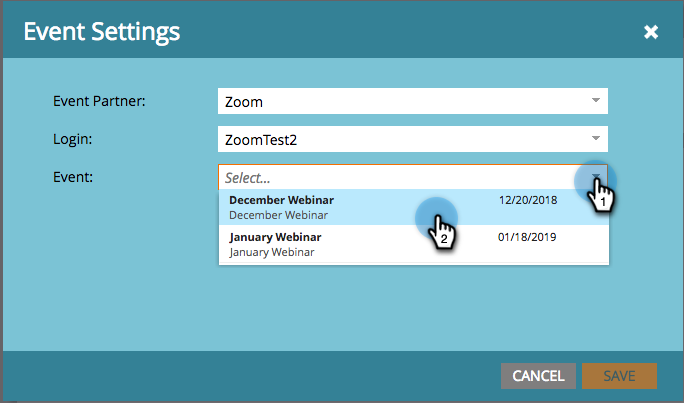

# Criar um evento com zoom {#create-an-event-with-zoom}

>[!PREREQUISITES]
>
>* [Adicionar Zoom como um Serviço do LaunchPoint](/help/marketo/product-docs/administration/additional-integrations/add-zoom-as-a-launchpoint-service.md)
>* [Criar um Novo Programa de Evento](/help/marketo/product-docs/demand-generation/events/understanding-events/create-a-new-event-program.md)
>* Definir as [ações de fluxo](/help/marketo/product-docs/core-marketo-concepts/smart-campaigns/flow-actions/add-a-flow-step-to-a-smart-campaign.md) apropriadas para rastrear o envolvimento

Primeiro, crie seu webinário em Zoom. Certas configurações na criação do Zoom são usadas pelo Marketo e algumas somente são usadas pelo Zoom.

Depois de criar um evento do Marketo e associar um webinário Zoom a ele, os sistemas poderão compartilhar informações de registro e presença. Para obter ajuda sobre como criar um webinário, consulte [Introdução aos webinários de zoom](https://support.zoom.us/hc/en-us/articles/200917029-Getting-Started-With-Webinar).

Insira as seguintes informações para seu webinário, que será extraído para o Marketo por meio do adaptador. Se você fizer alterações nessas informações, deverá clicar no link &quot;Atualizar do provedor de webinários&quot; em Ações de evento para que o Marketo veja as alterações.

**Título e Descrição**

* **Nome do webinário** - Digite o nome do webinário. Esse nome poderá ser visto no Marketo.

* **Descrição** (opcional) - Insira a descrição do webinário. A descrição será exibida no Marketo.

**Data e hora**

* **Data de início** - Digite a data de início. Ele poderá ser visto no Marketo.

* **Hora de início** - Digite sua hora de início. Ele poderá ser visto no Marketo.

* **Duração** - Insira a duração. A hora de início e a hora de término serão exibidas no Marketo.

* **Fuso Horário** - Selecione o fuso horário aplicável. Ele poderá ser visto no Marketo.

* **Webinar recorrente**- Mantenha desmarcado.

* **Registro** - Marque esta caixa para tornar o registro obrigatório. Você usará um formulário/página de aterrissagem do Marketo para capturar as informações de registro que serão encaminhadas para o Zoom.

>[!NOTE]
>
>No momento, o Marketo não oferece suporte a webinários recorrentes. Você deve configurar uma única sessão entre cada Evento do Marketo e o webinário de Zoom.

>[!TIP]
>
>No Zoom, você configurará outros campos que NÃO afetarão a integração. Consulte a [Central de Ajuda do Webinário de Zoom](https://support.zoom.us/hc/en-us/sections/200324965-Video-Webinar) para obter informações adicionais sobre esses campos.

Agora, vamos mergulhar no Marketo!

1. Selecione um evento. Clique em **Ações de Eventos** e escolha **Configurações de Eventos**.

   

   >[!NOTE]
   >
   >O tipo de canal do evento selecionado deve ser **webinário**.

1. Escolha **Zoom** da Lista **Evento** **Parceiro**.

   

1. Escolha a conta Zoom à qual deseja associar o evento.

   

1. Selecione o webinário.

   

1. Clique em **Salvar**.

   

   Excelente! Agora o evento é sincronizado e agendado pelo Zoom.

   >[!NOTE]
   >
   >Os campos que o Marketo envia são: Nome, Sobrenome, Endereço de email.

   >[!TIP]
   >
   >Para popular seu email de confirmação com esta URL exclusiva, use o seguinte token no email: `{{member.webinar url}}`. Quando o URL de confirmação é enviado, esse token é resolvido automaticamente para o URL de confirmação exclusivo da pessoa.
   >
   >Defina seu email de confirmação como **Operacional** para garantir que as pessoas que se registram e podem ter a assinatura cancelada ainda recebam suas informações de confirmação.

   As pessoas que se inscreverem no webinário serão encaminhadas ao seu provedor de webinário através da etapa de fluxo **Alterar status do programa** quando o Novo status estiver definido como &quot;Registrado&quot;. Nenhum outro status enviará a pessoa. Além disso, certifique-se de fazer a etapa de fluxo #1 do **Alterar status do programa** e a etapa de fluxo #2 do **Enviar email**.

   

   >[!CAUTION]
   >
   >Evite usar programas de email aninhados para enviar emails de confirmação. Em vez disso, use a campanha inteligente do programa do evento, como mostrado acima.

   >[!TIP]
   >
   >Pode levar até 48 horas para que os dados sejam exibidos no Marketo. Se depois de aguardar tanto tempo você ainda não vir nada, selecione **Atualizar do Provedor de Webinar** no menu Ações de Evento na guia **Resumo** do evento e clique no ícone de atualização na parte inferior direita da tela.
