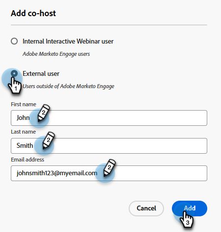

# Adicionar uma equipe ao webinário {#add-a-webinar-team}

Uma Equipe de webinários em webinários interativos consiste em todas as funções que contribuem para a entrega bem-sucedida do webinário no Adobe Connect. Isso inclui apresentadores e co-hosts.

>[!PREREQUISITES]
>
>* [Criar um webinário interativo](/help/marketo/product-docs/demand-generation/events/interactive-webinars/create-an-interactive-webinar.md){target="_blank"}
>
>* [Criar seu webinário interativo](/help/marketo/product-docs/demand-generation/events/interactive-webinars/designing-interactive-webinars.md){target="_blank"}

O apresentador é uma função externa que participa da entrega da experiência do webinário, enquanto os co-hosts podem atuar como apresentadores e lidar com os aspectos administrativos da entrega do webinário. Os co-hosts podem ser internos e externos. Os co-hosts externos não terão acesso aos Programas de evento de webinário interativo no Marketo, mas terão permissões de host durante a entrega no Adobe Connect. Os co-hosts internos terão acesso ao Programa de evento de webinário interativo no Marketo, bem como às permissões de host durante o delivery. Isso ajuda a garantir que os co-hosts internos possam assumir as rédeas do Programa de evento de webinário interativo quando o criador original do programa de webinário interativo não fizer mais parte do conjunto de usuários dos webinários interativos ou nem mesmo ser um usuário do Marketo.

>[!NOTE]
>
>Os apresentadores e os co-hosts no Marketo Engage mapeiam exatamente as funções de apresentador e host durante a entrega do webinário no Adobe Connect. Os co-hosts podem modificar os layouts e os pods, enquanto os apresentadores não podem.

## Adicionar um Co-host {#add-a-co-host}

1. Na página Visão geral do webinário interativo, clique em **Adicionar co-hosts**.

   

1. É possível adicionar usuários internos ou externos. Neste exemplo, escolheremos externo.

   

   >[!NOTE]
   >
   >Se você selecionar **Usuário interno do webinário interativo**, bastará clicar no menu suspenso **Hosts disponíveis** e escolher na lista de pessoas que foram adicionadas como usuários de webinários interativos no Marketo Engage. Os hosts existentes não se verão nessa lista suspensa, pois já são hosts.

1. Insira o nome, sobrenome e endereço de email do co-host desejado. Clique em **Adicionar**.

   

1. Seu novo coanfitrião aparecerá na seção Equipe do webinário.

   

>[!NOTE]
>
> O ícone  copia a URL de ingresso do co-host, e o ícone  envia um email de convite para o co-host.

## Adicionar um Apresentador {#add-a-presenter}

1. Na página Visão geral do webinário interativo, clique em **Adicionar apresentadores**.

   

1. Insira o nome, sobrenome e endereço de email do apresentador desejado. Clique em **Adicionar**.

   

   >[!NOTE]
   >
   >As informações do apresentador serão disponibilizadas ao Adobe Connect durante a entrega do webinário, para que os detalhes apropriados possam ser preenchidos automaticamente, sem que o usuário precise inseri-los durante a entrada para a entrega do webinário.

1. Seu novo apresentador aparecerá na seção Equipe do webinário.

   

>[!NOTE]
>
> O ícone  copia a URL de ingresso do apresentador, e o ícone  envia um email de convite para o apresentador.

>[!MORELIKETHIS]
>
>[Criar um webinário interativo](/help/marketo/product-docs/demand-generation/events/interactive-webinars/create-an-interactive-webinar.md){target="_blank"}
