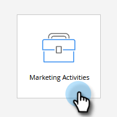

# Criar um webinário interativo {#create-an-interactive-webinar}

Introdução.

1. Ir para **Atividades de marketing**.

   

1. Clique com o botão direito do mouse na pasta desejada e selecione **Novo programa**.

PICC

1. Dê um nome ao evento. Em Tipo de programa, selecione **Evento**.

PICC

1. Clique no menu suspenso Canal e selecione **Webinar**.

PICC

1. Choose **Webinars interativos** e clique em **Criar**.

PICC

>[!NOTE]
>
>Informações sobre webinários de parceiros podem ser encontradas aqui.
