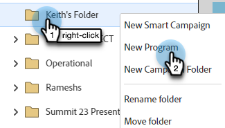

# Criar um webinário interativo {#create-an-interactive-webinar}

Crie um Webinário interativo em algumas etapas fáceis.

1. Vá para **Atividades de marketing**.

   

1. Clique com o botão direito do mouse na pasta desejada e selecione **Novo programa**.

   

   >[!CAUTION]
   >
   >[Os ativos de Notificação por Push para Dispositivos Móveis](/help/marketo/product-docs/mobile-marketing/push-notifications/understanding-push-notifications.md){target="_blank"} **não** são suportados em Webinars Interativos.

1. Dê um nome ao programa. Em Tipo de programa, selecione **Evento**.

   

1. Clique na lista suspensa Canal e selecione qualquer canal que tenha _Evento com Webinar_ na coluna &quot;Aplica-se a&quot;. Neste exemplo, estamos escolhendo **Webinar**.

   

   >[!NOTE]
   >
   >Para ver quais Canais se aplicam a _Evento com Webinar_, vá para **Administrador** > **Marcas**. &quot;Aplica-se a&quot; deve ser a coluna do meio. Saiba mais sobre &quot;Aplicável a&quot; na Etapa 5 de [este artigo](/help/marketo/product-docs/administration/tags/create-a-program-channel.md){target="_blank"}.

1. Escolha **Webinars interativos** e clique em **Avançar**.

   

1. Dê um título ao webinário e decida quanto tempo ele durará.

   

   >[!NOTE]
   >
   >* O título do webinário **é** visível para os participantes quando eles ingressam. É importante que o título seja diferente do nome do Programa de evento de webinários interativos na instância do Marketo Engage, bem como do nome da sala do webinário.
   >
   >* Não é possível reutilizar um título de webinário. Cada um deles deve ser exclusivo na instância do Marketo.
   >
   >* Você pode alterar o título do webinário em um estágio posterior, se desejar.
   >
   >* Se você criar um webinário de teste, ele precisará ser excluído antes da hora de início para garantir que a licença desse webinário não seja usada.

1. Agende a data/hora do seu webinário, altere o fuso horário (se desejar) e defina o tamanho máximo do público-alvo. Clique em **Criar** quando terminar.

   

>[!NOTE]
>
>Recomenda-se que dois eventos consecutivos sejam espaçados em 30 minutos (a menos que a licença suporte webinários simultâneos) como buffer caso o webinário anterior seja executado além do horário agendado.

Agora, é hora de [criar seu webinário](/help/marketo/product-docs/demand-generation/events/interactive-webinars/designing-interactive-webinars.md){target="_blank"}.
