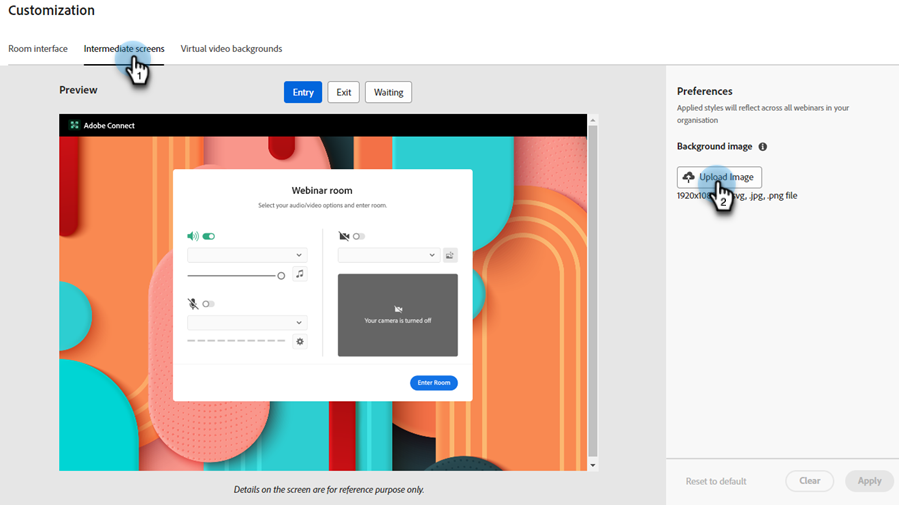

# Personalização de webinários interativos {#interactive-webinars-customization}

Personalizar os webinários é fundamental para criar uma experiência mais envolvente e eficaz para os participantes.

Os webinários interativos oferecem várias opções de personalização para adaptar o ambiente do webinário às suas necessidades. Personalize a aparência de telas diferentes para refletir a marca da sua organização.

Você pode personalizar as seguintes opções:

* Cores da marca para o quarto
* Plano de fundo personalizado para representar sua organização nas telas de entrada, saída e espera
* Logotipo
* Planos de fundo de vídeo virtual

## Conceder permissões {#grant-permissions}

Antes que qualquer usuário em sua organização possa personalizar seus Webinars interativos, um administrador do Marketo Engage deve primeiro adicionar acesso às funções desejadas.

1. No Marketo Engage, clique em **[!UICONTROL Admin]**.

   

1. Clique em **[!UICONTROL Usuários e funções]** e, em seguida, na guia **[!UICONTROL Funções]**.

   

1. Clique duas vezes na função à qual você deseja adicionar as permissões.

   

1. Clique para abrir o **[!UICONTROL Access Design Studio]**.

   

1. Marque a caixa de seleção **[!UICONTROL Acessar personalização de webinários interativos]**.

   

## Personalizar telas interativas do webinário {#customize-interactive-webinar-screens}

1. Vá para o **Design Studio**.

   

1. Clique em **Webinars Interativos** e selecione **Personalizar Webinars**.

   

1. É possível personalizar a interface da Sala, as telas Imediatas ou os planos de fundo de vídeo Virtual.

   

### Personalizar a interface da sala {#customize-the-room-interface}

Você pode personalizar a aparência da sala de sessões alterando o logotipo, o link de redirecionamento clicável e as cores. Suas alterações serão refletidas em todos os eventos e salas na organização.

Para personalizar a aparência de uma sala, selecione a guia Interface de sala na barra de menus.

1. No painel direito, personalize as seguintes preferências:

   

   **Logotipo personalizado**: selecione Carregar logotipo e procure a imagem de seu dispositivo. O tamanho da imagem não deve exceder 50 x 31 pixels e pode estar em formatos de arquivo diferentes: .svg, .gif, .jpg e .png. É possível alterar ou excluir o logotipo.

   **Link de redirecionamento**: adicione uma URL para redirecionar seus participantes depois que eles clicarem no logotipo.

   **Texto alternativo**: adicione um texto alternativo para participantes que usam recursos de acessibilidade.

   **Cores**: selecione cores para a barra de salas, os ícones de salas, o plano de fundo da sala, a barra de pods e os blocos/ícones de pods para alterar a cor de diferentes seções.

   Também é possível inserir o código de cor HEX usando a opção HEX.

   Selecione **[!UICONTROL Exibir modelos]** para alterar o tema da sala.

   Depois de fazer as alterações, você pode verificar o logotipo e as cores em Visualizar.

1. Selecione **[!UICONTROL Aplicar]** para salvar as alterações. Para redefinir para as configurações padrão, clique em **[!UICONTROL Redefinir para o padrão]**.

   

### Personalizar telas intermediárias {#customize-intermediate-screens}

Altere a imagem de fundo para alterar a aparência das telas de entrada, saída e espera. As alterações são refletidas em todos os eventos e salas da organização.

Para personalizar a aparência de uma sala, selecione a guia Telas intermediárias na barra de menus.

1. No painel direito, personalize a imagem de Plano de fundo selecionando **Carregar imagem** e procure um logotipo na imagem. O tamanho da imagem não deve exceder 1920 x 1080 pixels e pode estar em diferentes formatos de arquivo: .svg, .gif, .jpg e .png. É possível alterar ou excluir o logotipo, se desejado.

   

   >[!NOTE]
   >
   >A imagem carregada é aplicada nas telas Entry, Exit e Waiting.

1. Selecione **[!UICONTROL Aplicar]** para salvar as alterações. Para redefinir para as configurações padrão, clique em **[!UICONTROL Redefinir para o padrão]**.

### Personalizar planos de fundo de vídeos virtuais {#Customize-virtual-video-backgrounds}

Use os planos de fundo definidos pela organização durante os eventos para exibir o logotipo da organização ou a imagem da marca no plano de fundo do feed de vídeo da câmera. Para adicionar os planos de fundo virtuais de sua organização, selecione a guia Planos de fundo de vídeo virtual na barra de menus. Você pode optar por mostrar apenas planos de fundo personalizados, planos de fundo do Adobe Connect ou ambos.

**Planos de fundo personalizados**

1. Clique no botão de alternância para permitir planos de fundo personalizados em seus eventos e salas.

   

1. Selecione **Carregar plano de fundo** para carregar um plano de fundo personalizado. O tamanho da imagem não deve exceder 1920 x 1080 pixels e pode estar em diferentes formatos de arquivo: .svg, .gif, .jpg e .png.

Passe o mouse sobre a imagem de fundo personalizada para excluí-la dos planos de fundo do vídeo.

Depois de fazer as alterações, exiba o plano de fundo na Pré-visualização.

Você pode usar o controle deslizante na tela de Visualização para aumentar ou diminuir o zoom para testar como o plano de fundo virtual seria se o usuário estivesse perto ou longe da câmera. Se houver algum texto no fundo, isso ajudaria a garantir que ele permanecesse visível.

1. Selecione **[!UICONTROL Aplicar]** para salvar as alterações. Para redefinir para as configurações padrão, clique em **[!UICONTROL Redefinir para o padrão]**.

**Planos de fundo do Adobe Connect**

O Adobe Connect fornece nove planos de fundo padrão prontos para uso. Você pode ver sua aparência na Pré-visualização.

Use o botão de alternância para controlar a disponibilidade desses planos de fundo padrão em seus eventos e salas.

Selecione **Aplicar** para salvar as alterações ou **Redefinir para o padrão** para redefinir para as configurações padrão.
