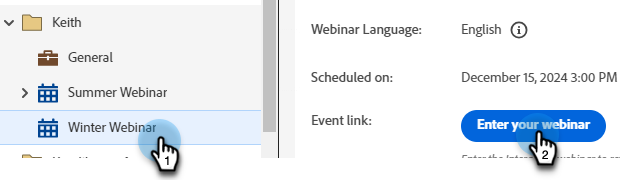

# Fornecer um webinário interativo {#deliver-an-interactive-webinar}

Seu webinário interativo está pronto para começar. Saiba tudo o que precisa saber sobre como apresentá-lo.

1. Selecione seu evento e clique em **Inserir seu webinário**.

   

   >[!NOTE]
   >
   >É recomendável fazer isso pelo menos 15 minutos antes da hora de início agendada.

1. Se você for um coanfitrião ou um apresentador, clique no link personalizado no email recebido para o webinário.

1. Selecione suas preferências de áudio/vídeo e clique em **Entrar na sala**.

   

1. Selecione o layout a ser mostrado para os primeiros ingressos.

   

   >[!NOTE]
   >
   >Os participantes podem entrar no quarto até 15 minutos antes do início agendado e verão o layout ativo. Recomendamos projetar um layout de &quot;Lobby&quot; para eles.

   >[!TIP]
   >
   >Ative os Controles de transmissão para entrar em uma sala verde virtual. Isso permite que os anfitriões e apresentadores falem de forma privada e se vejam sem que o áudio e o vídeo sejam transmitidos aos participantes da sala. É ideal antes e depois da sessão, onde você pode testar seu áudio e vídeo ou fazer um apontamento após o webinário.

1. Você pode gravar a sessão, se necessário. Selecione **Gravar sessão** no menu sala. A gravação pode ser interrompida posteriormente no mesmo menu.

   

1. Sua sessão começa no horário designado.

1. Clique no nome da sala. Na lista suspensa, selecione **Área de apresentação e apresentador** para conversar ou compartilhar anotações com a equipe de apresentação nos bastidores. A área de host e apresentador é aberta no lado direito da tela. Somente hosts/co-hosts e apresentadores podem ver essa parte da tela.

   

1. Quando a sessão estiver concluída, clique no ícone de seta vermelha e selecione **Encerrar sessão para todos**.

   

   >[!CAUTION]
   >
   >Clicar na sala de saída só fará com que você saia da sala. **não** encerrará o webinário.

   >[!TIP]
   >
   >Saiba mais sobre [desempenho e gravações de eventos](/help/marketo/product-docs/demand-generation/events/interactive-webinars/event-workflows.md){target="_blank"}.

## Experiência do participante {#participant-experience}

Os participantes podem participar do webinário clicando no link personalizado recebido após se registrarem no evento.

1. Os participantes que iniciarem o link do evento mais de 15 minutos antes do início agendado verão uma landing page informando que devem aguardar o início do evento.

   

1. Os participantes precisam selecionar suas preferências de áudio e clicar em Entrar na sala. Os participantes que ingressarem em uma sala do Adobe Connect pela primeira vez também verão um pop-up do navegador para obter permissão de microfone. O Adobe Connect precisa desse acesso para que os participantes possam usar o microfone posteriormente na sala.

   

   >[!NOTE]
   >
   >O pop-up de permissão pode ser fechado sem fornecer o acesso. Os participantes precisarão fornecer acesso dentro da sala se tentarem ativar o microfone.

## Configurações e áreas {#settings-and-areas}

### Área de apresentação {#host-and-presenter-area}

A &quot;área de apresentador&quot; (também chamada de &quot;Backstage&quot;) é uma área privada localizada no lado direito de uma sala de reunião que somente os apresentadores e os apresentadores podem ver. Ela pode ser usada para colaborar antes, durante e depois de um evento. Use Bate-papo, Notas e outros pods como backchannels na área Host e Apresentador.

Para acessar, selecione **área de Host e Apresentador** no menu suspenso da sala. Saiba mais sobre esta área no [vídeo a seguir](https://www.youtube.com/watch?v=11GkcvIUttY){target="_blank"}.

### Controles de Difusão {#broadcast-controls}

O Controle de transmissão adiciona uma sala verde virtual à sessão de Webinars interativos. Ele permite que anfitriões e apresentadores falem e se vejam de forma privada, sem transmitir para os participantes da sala. É uma ótima maneira de testar seu microfone e webcam antes de uma sessão. Os apresentadores também podem colaborar na área Host e apresentador até que estejam prontos para entrar em funcionamento. Ele fornece uma maneira para o palestrante e os produtores se informarem em particular após uma sessão, caso um participante se esqueça de sair do webinário.

Os Controles de transmissão podem ser configurados para iniciar automaticamente a gravação depois que você sair da sala verde. Isso garante que os hosts não precisem se lembrar de iniciar manualmente e parar a gravação. Pausar ou parar a transmissão também pausará ou interromperá a gravação. Tudo é automático.

Saiba mais sobre Controles de Difusão [neste vídeo](https://www.youtube.com/watch?v=TcoCeEJoyjg){target="_blank"}.

### Bate-papos em Gravações {#chats-in-recordings}

Dependendo do caso de uso, pode ser uma boa ideia incluir ou excluir o chat da sala nas gravações do evento.

As discussões dentro dos pods de Chat são sempre gravadas. Portanto, se as discussões de bate-papo agregarem valor à gravação de espectadores (os participantes e os espectadores sob demanda postam o evento ao vivo), use os pods de bate-papo ao projetar a sala.

A discussão no Painel de bate-papo não é gravada. O Painel de Bate-papo também libera o espaço que teria sido ocupado pelo pod de bate-papo dentro do layout. Portanto, se as discussões de bate-papo não adicionarem valor à gravação de espectadores, use o Painel de Bate-papo em vez de pods de bate-papo ao projetar a sala.

Saiba mais sobre o [Painel de Chat](https://helpx.adobe.com/adobe-connect/using/notes-chat-q-a-polls.html#chat_panel){target="_blank"}.

### Modo de preparação {#prepare-mode}

O Modo de preparação permite que os hosts e apresentadores criem ou modifiquem o layout de uma sala de reunião em segundo plano enquanto uma sessão está ocorrendo, mas sem que os participantes vejam as alterações até que o host as torne visíveis. A função Prepare Mode realça os pods ativos em pods azuis e não ativos em branco.

Para usar o Modo de preparação:

1. Clique no ícone da chave inglesa na parte inferior do Painel de layouts.

   

1. No painel Layouts, escolha o layout que deseja ajustar. Mova, oculte ou exiba pods conforme necessário. Você também pode atualizar o conteúdo em pods como carregar uma nova versão da apresentação em um pod de compartilhamento.

1. Quando as alterações forem concluídas, escolha **Encerrar Modo de Preparação** no menu suspenso ou clique no ícone de chave inglesa uma segunda vez.

Isso desativa o Modo de preparação e retorna ao layout ativo.

Saiba mais sobre o Modo de preparação [neste vídeo](https://www.youtube.com/watch?v=kUya84sx-E4){target="_blank"}.

>[!NOTE]
>
>* Quaisquer alterações feitas nos pods ao vivo são refletidas instantaneamente para os participantes.
>* O [Painel de Chat](https://helpx.adobe.com/adobe-connect/using/notes-chat-q-a-polls.html#chat_panel){target="_blank"} não faz parte do modo Preparar e qualquer alteração nele refletirá instantaneamente para os participantes.

### Acessibilidade {#accessibility}

A Adobe se esforça para incluir apresentadores e participantes com deficiência, melhorando a acessibilidade de Webinars interativos. O software é aprimorado continuamente para atender às necessidades de todos os tipos de usuários e para aderir aos padrões mundiais que incluem indivíduos com deficiências visuais, auditivas, de mobilidade ou outras.

Saiba mais sobre como a Adobe Connect oferece assistência para [necessidades visuais, auditivas e de mobilidade](https://helpx.adobe.com/adobe-connect/using/accessibility-features.html){target="_blank"}.

### Legendas codificadas {#closed-captions}

As legendas ocultas são uma representação textual do áudio dentro de uma sala de Adobe Connect e ajudam os participantes surdos ou com deficiência auditiva a participar de eventos. É possível integrar legendas em tempo real de conteúdo de áudio em eventos e apresentar essas legendas na exibição de Legendas ocultas.

Saiba como [habilitar legendas ocultas](https://helpx.adobe.com/adobe-connect/using/closed-captioning-html-client.html){target="_blank"}.
