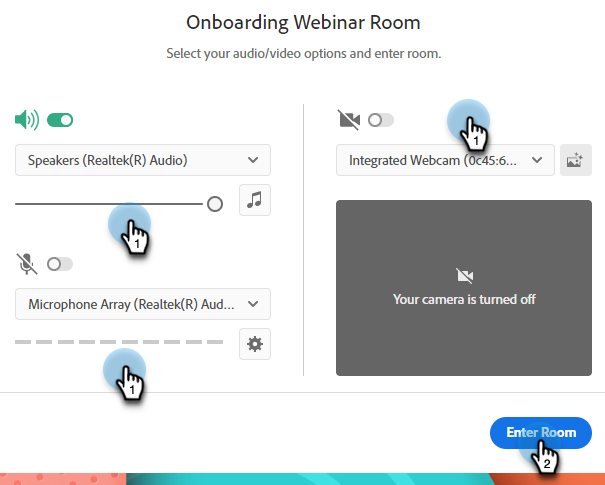

# Criação de webinários interativos {#designing-interactive-webinars}

Saiba como projetar seu webinário para atender às suas necessidades.

1. Selecione o evento e clique em **Projetar o webinário**.

   

1. Você pode escolher uma sala de webinários existente ou criar uma nova. Neste exemplo, estamos criando um novo, então clique no link **Selecionar Sala** e escolha **Nova sala de webinários interativa**.

   

   >[!NOTE]
   >
   >* Sala é um espaço online usado para conduzir reuniões.
   >
   >* Se você escolher uma Sala de webinários existente e precisar renomeá-la, basta clicar no link **Renomear sala de webinário** botão à direita.
   >
   >* O menu suspenso mostra apenas as salas existentes que você criou anteriormente, não as de outros hosts.

1. Escolha um modelo.

   

1. Sua visualização do webinário será exibida.

   

   >[!NOTE]
   >
   >Por padrão, o nome da sala indicado no campo &quot;Nome da sala do webinário interativo&quot; é o mesmo nome do Programa de evento do webinário interativo. Você tem a opção de alterá-lo para refletir o título do próprio webinário, já que esse nome é visível para seu público-alvo.

   >[!TIP]
   >
   >Seu webinário será definido como o idioma padrão na instância do Marketo Engage, mas você tem a opção de alterar os idiomas por webinário usando o menu suspenso acima da visualização.

1. É possível selecionar diferentes layouts para visualização. Para continuar, clique em **Usar modelo**.

   

1. Você pode refinar seu webinário imediatamente ou mais tarde. Vamos fazer isso agora. Clique em **Refine seu webinário agora**.

   

1. Selecione as preferências de áudio/vídeo e clique em **Entrar na sala**.

   

1. O modelo selecionado agora é editável.

   

1. Para obter informações detalhadas sobre salas e modelos, consulte a seção &quot;Modelos e layouts de salas de reunião&quot; de [este artigo de ajuda do Adobe](https://helpx.adobe.com/in/adobe-connect/using/creating-arranging-meetings.html#creating_and_arranging_meetings){target="_blank"}.

1. Quando terminar de criar o webinário, clique em **Sala de saída**.

   

## Elementos de design {#design-elements}

**Modelo**: estrutura fornecida para uma sala com base no objetivo do webinário que está sendo fornecido. Por exemplo, se você quiser agendar um webinário de demonstração de produto, o compartilhamento de tela será um componente essencial para apresentar a demonstração. O modelo garante que os componentes essenciais necessários para uma entrega eficaz de um tipo específico de webinário estejam em vigor durante a configuração da sala de webinários.

**Layout**: refere-se a várias maneiras pelas quais os vários componentes necessários para garantir o sucesso do webinário são organizados em um modelo específico. Um único modelo pode ter vários layouts para sua escolha. Os componentes essenciais do webinário permaneceriam os mesmos em todos os modelos. A organização selecionada seria mais adequada ao estilo/às necessidades do apresentador ou do apresentador que realiza o webinário.

**Pod**: um componente dentro de um modelo que executa uma atividade específica durante o webinário. Por exemplo, configurar e entregar uma pesquisa para capturar as respostas dos participantes em uma atividade que pode ser preenchida por um pod de pesquisa. Da mesma forma, conversar com os participantes para transmitir uma mensagem ou interagir casualmente com eles pode ser uma atividade entregue por meio do pod de chat. Vários outros pods estão disponíveis, como Compartilhamento, Notas, Vídeo, Chat, Lista de participantes, Arquivos, Links da Web, Pesquisas e Perguntas e respostas.
