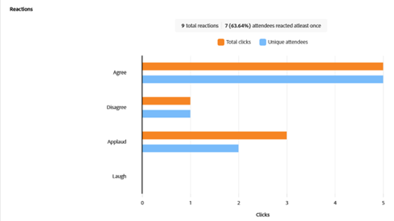

# Painel de engajamento {#engagement-dashboard}

Webinars interativos alimentados pelo Adobe Connect usam vários pods para envolver os participantes em bate-papos, perguntas e respostas, questionários e pesquisas. O painel de envolvimento permite rastrear as métricas principais e as visualizações de dados.

Veja uma exibição consolidada das atividades, interações e envolvimento do participante durante um evento. Como host, você pode visualizar o desempenho de eventos ao vivo e sob demanda e baixar vários relatórios após a sessão. Além disso, os relatórios pós-webinário gerados no painel são usados para avaliar a eficácia da sessão, informar o conteúdo futuro e melhorar a estratégia geral do webinário.

O painel rastreia várias métricas, incluindo respostas de pesquisa, atividade de chat e interações de vídeo, oferecendo insights valiosos sobre as preferências e os comportamentos dos participantes. Ele fornece uma visão geral abrangente da atividade e dos níveis de engajamento do participante, permitindo que os hosts monitorem a participação, as interações e a participação em tempo real.

Visualize o engajamento para os seguintes tipos de sessões em um webinário interativo.

* **Sessão ao vivo**: uma sessão online em tempo real onde os participantes podem se envolver ativamente.
* **Sessão sob demanda**: a gravação do evento ao vivo é disponibilizada como um evento próprio. Novos convidados podem se registrar e assistir à gravação. Após o registro, eles receberão um link de associação de evento, que os leva para a gravação do evento após o término. Os participantes inscritos no evento ao vivo também podem exibir a gravação usando o mesmo link de ingresso.

## Exibir o painel {#view-the-dashboard}

1. Vá para **[!UICONTROL Atividades de marketing]**.

   

1. Selecione o evento concluído desejado.

   

1. Na Visão Geral, clique em **[!UICONTROL Exibir Painel de Envolvimento]**.

   

   >[!NOTE]
   >
   >O painel de engajamento pode ser acessado de 45 a 120 minutos após o término do evento programado.

## Detalhes do painel {#dashboard-details}

Você pode exibir os seguintes detalhes no painel de engajamento.

<table><tbody>
  <tr>
    <td><b>Resumo do evento</td>
    <td>Fornece uma visualização consolidada do desempenho de sessões ativas e sob demanda.</td>
  </tr>
  <tr>
    <td><b>Envolvimento</td>
    <td>Fornece uma visão geral do desempenho das sessões ativas.</td>
  </tr>
  <tr>
    <td><b>Interações</td>
    <td>Fornece uma exibição detalhada do envolvimento dos participantes em todos os pods.</td>
  </tr>
  <tr>
    <td><b>Atividade sob demanda</td>
    <td>Fornece um resumo do desempenho da gravação.</td>
  </tr>
  <tr>
    <td><b>Atividade do participante</td>
    <td>Fornece uma visão consolidada do contrato.</td>
  </tr>
  <tr>
    <td><b>Baixar relatórios</td>
    <td>Baixe relatórios do engajamento em diferentes pods.</td>
  </tr>
</tbody>
</table>

### Resumo do evento {#event-summary}

Essa interface fornece uma visualização consolidada do desempenho do evento para sessões ativas e sob demanda. No painel esquerdo, selecione Resumo de eventos para visualizar as métricas gerais.

<table><tbody>
  <tr>
    <td><b>Total de registros</td>
    <td>Mostra o número de participantes que se registraram no evento.</td>
  </tr>
  <tr>
    <td><b>Total de participantes</td>
    <td>Mostra o número de participantes que participaram do evento.</td>
  </tr>
  <tr>
    <td><b>Taxa de conversão de inscrição para participante</td>
    <td>Isso mostra o percentual de participantes que se inscreveram e participaram do evento.</td>
  </tr>
  <tr>
    <td><b>Os visualizadores participaram ao vivo e sob demanda</td>
    <td>Ele mostra o número de participantes que participaram de eventos ao vivo e sob demanda.</td>
  </tr>
</tbody>
</table>

### Envolvimento {#engagement}

Fornece uma visão geral do desempenho de um evento na sessão ativa. A visão geral inclui métricas principais, envolvimento ao longo do tempo e interações dos participantes. Ele ajuda os organizadores a avaliar o sucesso do evento e identificar áreas para aprimoramento.

No painel esquerdo, selecione **[!UICONTROL Envolvimento]** para exibir o desempenho da sessão ativa. **[!UICONTROL Clique em Resumo de engajamento (PDF)]** para baixar o resumo de desempenho da sessão em tempo real. A visão geral fornece dados em diferentes seções.

**Métricas principais**

Exiba o número de inscrições, participantes e envolvimento na sessão em tempo real.

<table><tbody>
  <tr>
    <td><b>Registros</td>
    <td>Exiba o número de registros para a sessão ao vivo.</td>
  </tr>
  <tr>
    <td><b>Participantes</td>
    <td>Exibir o número de participantes presentes na sessão em tempo real.</td>
  </tr>
  <tr>
    <td><b>Altamente engajado</td>
    <td>Exiba o número de participantes que foram altamente engajados durante a sessão ao vivo e provavelmente serão os principais prospetos.</td>
  </tr>
  <tr>
    <td><b>Moderadamente engajado</td>
    <td>Visualize o número de participantes moderadamente engajados durante a sessão ao vivo.
     <b>Observação</b>: esses números são computados com base no envolvimento e nas interações durante a sessão.</td>
  </tr>
  <tr>
    <td><b>Duração média da inspeção em minutos</td>
    <td>Exibe a duração média da inspeção em minutos da sessão ativa.</td>
  </tr>
</tbody>
</table>

**Participação ao longo do tempo**

Saiba mais sobre o engajamento médio ao longo do tempo durante a sessão ao vivo pelos gráficos de engajamento. Os hosts podem monitorar como os níveis de engajamento flutuam, permitindo que eles identifiquem momentos críticos de alta ou baixa interação. Veja quanto da pontuação média de engajamento foi obtida pelos participantes engajados em diferentes layouts.

Ao passar o mouse sobre o gráfico, exiba as seguintes informações:

* A hora em que o nível de envolvimento é monitorado.
* Pontuação média de engajamento nesse momento.
* Número de participantes envolvidos no momento.
* Layout do compromisso naquele momento.
* Selecione **[!UICONTROL Exibir instantâneo na gravação]** para exibir o instantâneo na gravação em que a participação foi alta ou baixa.
* Pontuação média de engajamento (%) ao longo do tempo na sessão
* Presença ao longo do tempo durante a sessão
* O engajamento em diferentes layouts de webinário é mostrado quando diferentes layouts são usados dentro da sala durante o evento. Isso ajuda a correlacionar o aumento e a queda do engajamento em diferentes layouts.

**Interações de participante**

Você pode visualizar as interações dos participantes de diferentes pods. Ele fornece informações como Pesquisas respondidas, Perguntas feitas, Interagir com o chat, Clicou em pelo menos um link e Baixou pelo menos um arquivo.

Selecione **[!UICONTROL Ir para interações]** para exibir as respostas das pesquisas, métricas de QnA e reações dos participantes durante a sessão. Veja como os participantes estão envolvidos em pods de Interações e baixe relatórios de interação da seção abaixo.

### Interações {#interactions}

Veja como os participantes interagem e se envolvem na sessão em Interações. Rastreie respostas a pesquisas, métricas de QnA, reações dos participantes e links e arquivos descartados dos respectivos pods. Os hosts também podem baixar relatórios de interação desses pods para melhor análise. Ao analisar essas interações, é possível identificar tendências e ajustar suas estratégias para incentivar um ambiente mais interativo e envolvente.

No painel esquerdo, selecione **[!UICONTROL Interações]** para ver como os participantes estão envolvidos em pods.

Selecione a guia **[!UICONTROL Pesquisas]** na barra de menus para exibir perguntas e respostas adicionadas à pesquisa. Essa guia mostra as seguintes informações:

* Selecione **[!UICONTROL Relatório de enquete (CSV)]** para baixar o relatório para interações no pod de enquete.
* Pergunta da enquete e seu tipo.
* Número de respostas e o período durante o qual o pod de enquete foi aberto e envolvido.
* Selecione **Exibir todas as `<number>` respostas** para exibi-las em uma janela de caixa de diálogo.

Selecione a guia **[!UICONTROL Outras interações]** na barra de menus para exibir o envolvimento em outros pods e baixar seus relatórios.

Selecione **[!UICONTROL Baixar relatórios de interação]** no menu suspenso para baixar relatórios de pods diferentes. Baixe o relatório de QnA, o relatório de Links e arquivos e o relatório de Reações aqui para obter um melhor rastreamento.

As informações de engajamento nos pods estão disponíveis em diferentes seções.

**Métricas de QnA**

Exiba os seguintes atributos do pod de Perguntas e respostas.

* Total de perguntas feitas.
* Número de perguntas não respondidas.
* Número de participantes que fizeram perguntas.
* Número de participantes que fizeram mais de uma pergunta que provavelmente serão os principais prospetos.
* Tempo médio necessário para responder uma pergunta.

**Reações**

Exibir as reações dos participantes daqui, como concordar, discordar, aplaudir e rir durante a sessão.

No gráfico de reações, visualize os seguintes detalhes:

* Total de reações
* Número de participantes que reagiram pelo menos uma vez
* Total de cliques
* Participantes únicos
* Tendência de cliques em reações com base no total de cliques relativos a participantes únicos.

**pod de Weblinks**

Visualize os links adicionados ao pod de links da Web durante a sessão e o número de cliques no link compartilhado. O pod Weblinks permite adicionar links de fontes fora do webinário para gerar engajamento.

No gráfico, exiba os seguintes detalhes:

* Links que são adicionados ao pod weblinks.
* Número de participantes que clicaram em pelo menos um link.
* Número de links inicializados pelo host.
* Tendência de cliques únicos em cada link adicionado ao pod weblinks.

**pod de arquivos**

Visualize os arquivos adicionados ao pod de arquivos durante a sessão e o número de downloads únicos. O pod Arquivos permite adicionar arquivos e fornecer recursos para gerar engajamento.

No gráfico, exiba os seguintes detalhes:

* Nome dos arquivos que são adicionados ao pod de arquivos.
* Número de participantes que baixaram pelo menos um arquivo.
* Tendência de downloads exclusivos em cada arquivo adicionado ao pod do weblinks.

### Atividade sob demanda {#on-demand-activity}

No painel esquerdo, selecione **[!UICONTROL Atividade sob demanda]** para exibir o resumo das gravações. Você também pode baixar um relatório para atividade sob demanda.

Em atividades por demanda, visualize as seguintes métricas:

* Clique em **[!UICONTROL Relatório por demanda (CSV)]** para baixar as métricas por demanda.
* Número de visualizadores únicos até a última atualização do painel.
* Número de visualizadores que visualizaram a gravação, mas não puderam participar do webinário.
* Número de visualizadores que participaram do webinário e visualizaram a gravação. Eles provavelmente serão os principais prospetos.
* Número de visualizadores que se registraram para a sessão sob demanda.
* Duração média do monitoramento de gravação em minutos.

### Atividade do participante {#participant-activity}

No painel esquerdo, selecione **[!UICONTROL Atividade do participante]** para exibir informações consolidadas sobre o nível de envolvimento de cada participante. Exibir como este compromisso é classificado em níveis a partir do nível de envolvimento do Participante. Clique em **[!UICONTROL Relatório de atividades do usuário (CSV)]** para baixar o relatório e melhorar o rastreamento.

Exiba os seguintes detalhes da tabela:

* Nível de engajamento de cada participante. Você também pode classificá-los de cima para baixo ou vice-versa.
* Duração da sessão em que o participante participou.
* Pesquisas respondidas pelo participante.
* Arquivos baixados pelo participante do pod de arquivos.
* Links clicados pelo participante do pod weblinks.
* Perguntas feitas pelo participante do pod QnA.

### Baixar relatórios {#download-reports}

Baixe relatórios para diferentes atividades e pods de um hub centralizado como um host.

1. No painel esquerdo, selecione **[!UICONTROL Baixar relatórios]**.

1. Selecione **[!UICONTROL Baixar tudo (.zip)]** para baixar relatórios para todas as atividades e pods, tudo de uma vez.

   

>[!NOTE]
>
>Clique no ícone de download ao lado de cada relatório para baixá-los individualmente.

## Nível de engajamento do participante {#participant-engagement-level}

As organizações usam o Adobe Connect para fornecer webinários altamente personalizados, com marca e promovidos pelo envolvimento. Ferramentas interativas como pesquisas, bate-papo, perguntas e respostas e reações ajudam a engajar os participantes e coletar mais do que apenas dados de registro e presença. Depois que os participantes interagem com esses recursos interativos, os dados de envolvimento são usados para classificar os participantes em três níveis de envolvimento: alto, médio e baixo. Você pode usar o nível de envolvimento para atualizar segmentos de público-alvo, atualizar pontuações de pessoas e alertar vendas.

Entenda os critérios para classificar o nível de engajamento de cada participante:

<table><thead>
  <tr>
    <th>Nível de envolvimento</th>
    <th>Critérios de classificação</th>
  </tr></thead>
<tbody>
  <tr>
    <td>Alto</td>
    <td>Participantes que satisfaçam todos os seguintes critérios:
    <li>A duração da presença é de pelo menos 80% do tempo total do evento.</li>
    <li>Todas as pesquisas de perguntas de múltipla escolha (MCQs) e respostas múltiplas (MA) são respondidas, pelo menos um arquivo é baixado ou o número de bate-papos publicados é cinco ou mais.</li>
    <li>O participante fez pelo menos uma pergunta no pod de Perguntas e Respostas.</li></td>
  </tr>
  <tr>
    <td>Meio</td>
    <td>Participantes que satisfaçam todos os seguintes critérios:
    <li>O nível de envolvimento do participante não está determinado como sendo alto.</li>
    <li>A duração da presença é de pelo menos 60% do tempo total do evento.</li>
    <li>Pelo menos uma das seguintes ações foi executada pelo participante:
    <ul>
    <li>Respondeu pelo menos uma enquete.
    <li>Pelo menos uma pergunta foi feita no pod de perguntas e respostas.<li>Baixado pelo menos um arquivo.
    <li>Clicou (mas não foi iniciado) em pelo menos um link da Web.<li>Publicado três ou mais chats.</ul></li>
    </td>
  </tr>
  <tr>
    <td>Baixo</td>
    <td>Todos os participantes não classificados como altos ou médios.</td>
  </tr>
</tbody></table>
