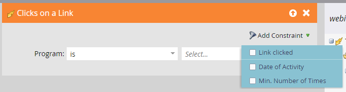

# Fluxos de trabalho do evento {#event-workflows}

Depois que o webinário for concluído, acesse a guia Dashboard para ver o desempenho agregado.

>[!NOTE]
>
>Se o webinar não tiver sido concluído ou os dados não tiverem sido recebidos por qualquer motivo, a guia Painel ainda não estará disponível.

## Widgets do painel {#dashboard-widgets}

O Painel consiste em quatro widgets.

**Status do programa de evento**: Mostra os vários status do programa para esse evento e o número de membros do programa que atualmente possuem esse valor de status do programa.

**Participação**: Destaca a duração da participação de vários membros que participaram do webinário em comparação à duração geral do webinário em termos de porcentagem.

**Desempenho da pesquisa**: Exibe várias pesquisas iniciadas durante o webinário no Adobe Connect e a distribuição dos membros que participaram e responderam à pesquisa em cada uma das respostas.

**Atividade de clique e download de arquivo**: Fornece a contagem de download de arquivos e links da Web clicados durante o Webinar no Adobe Connect por vários membros que participaram do webinário e realizaram essa ação específica.

## Triggers e filtros {#triggers-and-filters}

Use acionadores e filtros interativos relacionados ao webinário para localizar grupos específicos de pessoas em seu Programa de eventos.

Cada acionador/filtro vem com restrições adicionais, permitindo capturar um subconjunto focalizado desse grupo.

**Pergunta durante o evento** (Versão do filtro: Fez perguntas durante o evento)

**Evento de participação** (Versão do filtro: Participou do evento)

**Cliques em um link** (Versão do filtro: Clicado em um link)

**Baixar um ativo** (Versão do filtro: Baixado um ativo)

**Responde a uma pesquisa** (Versão do filtro: Respondido a uma pesquisa)

