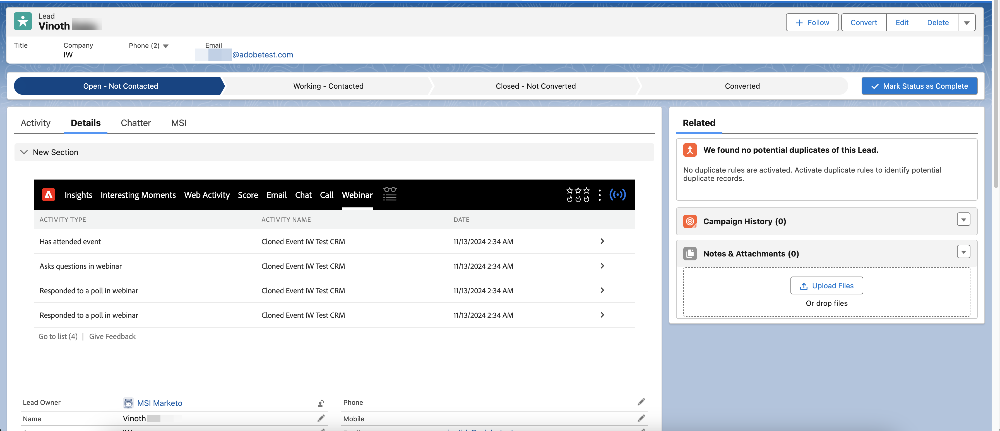

# Webinars interativos no Marketo Sales Insight {#interactive-webinars-in-marketo-sales-insight}

Os webinários interativos no Marketo Sales Insight disponibilizam as atividades dos webinars no plug-in Marketo Sales Insight (MSI) no Salesforce.

>[!PREREQUISITES]
>
>Este recurso só tem suporte para quem comprou o complemento [Marketo Sales Insight](https://business.adobe.com/products/marketo/sales-intelligence-engagement.html).

Depois que as atividades são registradas no Marketo Engage (após a conclusão do webinário no Adobe Connect), elas são sincronizadas em tempo real com o Salesforce por meio do plug-in MSI.

Todas as atividades que foram disponibilizadas no Marketo Engage são sincronizadas. Essas atividades são:

* Participa de um evento
* Responde a uma enquete
* Responde uma pergunta
* Clica em um link
* Baixa um ativo

Todos os atributos relevantes dessas atividades também são disponibilizados para o vendedor revisar e tomar medidas em relação aos leads individuais. As informações da atividade estão disponíveis na seção Insights genéricos, bem como em uma guia Webinar separada.

Na seção Insights, o gráfico Linha do tempo do lead contém outra raia para webinários que destaca as atividades sincronizadas nos últimos 90 dias para cada semana. Ao selecionar uma semana específica, as atividades são exibidas por dia em uma seção separada. Você pode expandir atividades individuais para ver seus detalhes.

{width="800" zoomable="yes"}

Na guia Webinar separada, todas as atividades (e suas datas) também são listadas em formato de tabela.

{width="800" zoomable="yes"}
