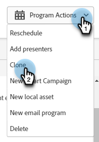

# Modificar ou excluir um webinar interativo {#modify-or-delete-an-interactive-webinar}

Introdução.

## Modificar um webinar interativo {#modify-an-interactive-webinar}

1. Selecione o Programa de evento desejado e clique em **Alterar Sala/Modelo**.

   

1. Texto

PICC

## Reprogramar um webinar interativo {#reschedule-an-interactive-webinar}

1. Selecione o Programa de evento desejado e clique no ícone de lápis ao lado da data/hora programada no momento.

   

1. Clique no ícone do calendário, escolha a nova data/hora e clique em **Salvar**.

   

## Clonar um webinário interativo {#clone-an-interactive-webinar}

1. Selecione o Programa de evento desejado.

   

1. Clique no menu suspenso Ações do programa e selecione **Clonar**.

   

   >[!TIP]
   >
   >Você também pode clicar com o botão direito do mouse no Programa de eventos na árvore e selecionar **Clonar** de lá.

## Excluir um webinar interativo {#delete-an-interactive-webinar}

1. Selecione o Programa de evento desejado.

   

1. Clique no menu suspenso Ações do programa e selecione **Excluir**.

   

   >[!TIP]
   >
   >Você também pode clicar com o botão direito do mouse no Programa de eventos na árvore e selecionar **Excluir** de lá.
