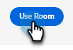
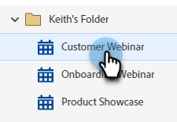
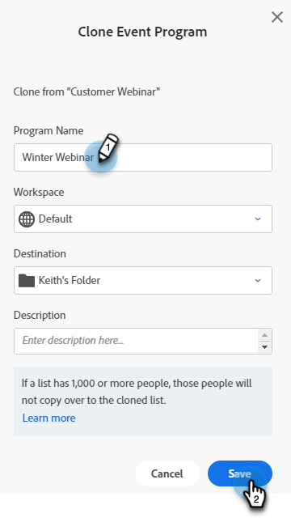

# Modificar ou excluir um webinário interativo {#modify-or-delete-an-interactive-webinar}

Saiba como fazer alterações no webinário interativo.

## Modificar um webinário interativo {#modify-an-interactive-webinar}

1. Selecione o Programa de Eventos desejado e clique em **Alterar Sala/Modelo**.

   

1. O quarto será carregado. Se quiser alterar a sala, selecione uma no menu suspenso Salas. Para apenas atualizar seu modelo, clique em **Usar Sala**.

   

>[!NOTE]
>
>Mudar sua sala é opcional e não é necessário para atualizar seu modelo.

1. Clique Em **Refinar Seu Webinário Agora**.

   

1. Selecione suas preferências de áudio/vídeo e clique em **Entrar na sala**.

   

1. Quando terminar de fazer as modificações, clique em **Sair da Sala**.

   

## Reprogramar um webinário interativo {#reschedule-an-interactive-webinar}

1. Selecione o Programa de evento desejado e clique no ícone de lápis ao lado da data/hora agendada no momento.

   

1. Clique no ícone do calendário, escolha a nova data/hora e clique em **Salvar**.

   

## Clonar um webinário interativo {#clone-an-interactive-webinar}

1. Selecione o Programa de evento desejado.

   

1. Clique na lista suspensa Ações do programa e selecione **Clonar**.

   

   >[!TIP]
   >
   >Você também pode clicar com o botão direito do mouse no Programa de evento na árvore e selecionar **Clonar** a partir daí.

1. Dê um nome ao programa clonado, defina Workspace e Destino (se desejar que o programa fique em outro lugar) e clique em **Salvar**.

   

1. Clique em **Avançar**.

   

   >[!NOTE]
   >
   >Você só pode salvar um Webinar interativo clonado como um Webinar interativo no momento. Salvar um webinário clonado como um webinário de parceiro (por exemplo, Zoom, ON24 etc.) estará disponível em breve.

1. Escolha as configurações do webinário clonado e clique em **Clonar**.

   

## Excluir um webinário interativo {#delete-an-interactive-webinar}

>[!NOTE]
>
>Se você criar um webinário de teste, ele precisará ser excluído antes da hora de início para garantir que a licença desse webinário não seja usada.

1. Selecione o Programa de evento desejado.

   

1. Clique no menu suspenso Ações do Programa e selecione **Excluir**.

   

   >[!TIP]
   >
   >Você também pode clicar com o botão direito do mouse no Programa de evento na árvore e selecionar **Excluir**.

1. Clique em **Excluir**.

   

   >[!IMPORTANT]
   >
   >Se houver ativos locais no programa, eles também serão excluídos.
