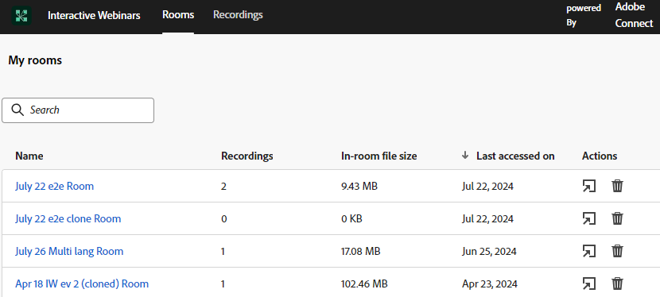

# Gerenciamento de Salas {#room-management}

As salas de webinários interativas alimentadas pela Adobe Connect foram projetadas para facilitar eventos online envolventes e colaborativos. Esses webinários armazenam conteúdo e gravações criadas e usadas durante o webinário. Como membro com o direito de criar salas, você pode acessá-las e gerenciá-las de um local central.

>[!NOTE]
>
>Você só pode acessar as salas criadas para um webinário, e não as salas de outros membros da organização.

## Gerenciar e acessar Salas e Gravações {#manage-and-access-rooms-and-recordings}

1. Vá para o **[!UICONTROL Design Studio]**.

   

1. Selecione **[!UICONTROL Webinars interativos]** e **[!UICONTROL Gerenciar salas]**.

   

### Salas {#rooms}

Uma sala de webinar interativa é um espaço virtual projetado para hospedar eventos online ao vivo, envolventes, nos quais os participantes podem interagir com o apresentador e outros participantes. Nessas salas, você pode encontrar o conteúdo carregado e gravações de webinários.

Para exibir a lista de todas as suas salas, selecione **[!UICONTROL Salas]** na barra de menu superior. Nessas salas, você pode encontrar todas as salas que criou, juntamente com o conteúdo carregado e as gravações. Você também pode visualizar o número de gravações, o tamanho do arquivo na sala e a data do último acesso para as respectivas salas.

<table><tbody>
  <tr>
    <td><b>Gravações</td>
    <td>Veja o número de gravações disponíveis em uma sala.</td>
  </tr>
  <tr>
    <td><b>Tamanho do arquivo na sala</td>
    <td>Visualize o tamanho de arquivo combinado do conteúdo e das gravações disponíveis em uma sala.</td>
  </tr>
  <tr>
    <td><b>Último acesso em</td>
    <td>Mostra a data em que a sala foi acessada pela última vez. Você pode classificar as informações com base na linha do tempo.</td>
  </tr>
</tbody>
</table>

Você pode executar as seguintes ações a partir dessa interface centralizada:

* Clique no ícone da sala Iniciar para iniciar e entrar na sala.
* Use a barra de pesquisa para localizar a sala que você está procurando (pesquisará somente as salas que você criou).
* Clique no ícone Excluir sala para remover a sala. Isso excluirá todas as gravações e arquivos relacionados à sala.

Quando você seleciona uma sala, pode exibir o conteúdo ou as gravações disponíveis na sala. Nesta tela, as informações estão disponíveis em duas guias: a guia **Conteúdo** e a guia **Gravações**.

**Guia Conteúdo**

A guia Content permite visualizar os arquivos carregados, seu tipo, tamanho, data do último acesso e data de upload.

<table><tbody>
  <tr>
    <td><b>Tipo</td>
    <td>Mostra o tipo de arquivo como PDF, JPG, PNG, etc.</td>
  </tr>
  <tr>
    <td><b>Tamanho</td>
    <td>Visualize o tamanho do arquivo disponível.</td>
  </tr>
  <tr>
    <td><b>Último acesso em</td>
    <td>Mostra a data em que a sala foi acessada pela última vez. Você pode classificar as informações com base na linha do tempo.</td>
  </tr>
  <tr>
    <td><b>Carregado(a)s</td>
    <td>Mostra quando o arquivo foi carregado.</td>
  </tr>
</tbody>
</table>

Você pode executar as seguintes ações na guia Content:

* Clique no botão **[!UICONTROL Iniciar sala]** para iniciar e entrar na sala.
* Use a barra de pesquisa para localizar o arquivo que você está procurando.
* Clique no ícone Baixar arquivo para baixar um arquivo em seu dispositivo. Selecione dois ou mais arquivos para baixar em massa.
* Clique no ícone Excluir sala para remover a sala. Quando um arquivo é excluído, ele não pode ser recuperado.
* Selecione qualquer arquivo do conteúdo listado para exibi-lo no dispositivo.

**Guia Gravações**

A guia Gravações permite exibir todas as gravações disponíveis nesta sala. Cada gravação é exibida com detalhes como tamanho, data e hora da gravação e duração.

Você pode executar as seguintes ações a partir desse hub centralizado:

* Clique no botão **[!UICONTROL Iniciar sala]** para iniciar e entrar na sala.
* Use a barra de pesquisa para localizar a gravação que você está procurando.
* Clique no ícone Baixar arquivo para baixar um arquivo em seu dispositivo. Selecione dois ou mais arquivos para baixar em massa.
* Clique no ícone Copiar link de gravação para copiar o URL de gravação.
* Clique no ícone Editar Gravação para fazer alterações na gravação.
* Clique no ícone Excluir para remover a gravação. Quando uma gravação é excluída, ela não pode ser recuperada.
* Selecione uma gravação para reproduzi-la no dispositivo.

## Gerenciar e acessar Gravações {#manage-and-access-recordings}

As gravações são recursos inestimáveis, capturando a essência das discussões, apresentações e sessões de perguntas e respostas ao vivo. Eles permitem que os participantes revisitem os principais insights, detalhes perdidos ou conceitos complexos em seu próprio ritmo.

Clique na guia **[!UICONTROL Gravações]** para ver uma lista de todas as gravações carregadas.

Em **[!UICONTROL Minhas gravações]**, você pode encontrar todas as gravações disponíveis na sala que criou. Você também pode visualizar seu respectivo tamanho, data e hora e duração das gravações.

Você pode executar as seguintes ações a partir desse hub centralizado:

* Use a barra de pesquisa para localizar a gravação que você está procurando. Também é possível pesquisar em uma linha do tempo selecionando um Intervalo de datas.
* Clique no ícone Copiar link de gravação para copiar o URL de gravação.
* Clique no ícone Editar Gravação para fazer alterações na gravação.
* Clique no ícone Mostrar página vinculada para exibir as informações sobre a sala na qual a gravação selecionada está disponível.
* Clique no ícone Excluir para remover a gravação. Quando uma gravação é excluída, ela não pode ser recuperada.
* Selecione uma gravação para reproduzi-la no dispositivo.
