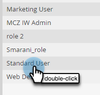
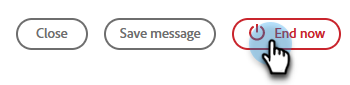

# Modelos para webinários interativos {#templates-for-interactive-webinars}

Crie modelos reutilizáveis em Webinars interativos para produzir conteúdo mais rápido e manter-se em conformidade com as diretrizes da marca ao trabalhar em uma equipe.

## Conceder permissões {#grant-permissions}

Antes que qualquer usuário em sua organização possa acessar modelos em seus Webinars interativos, um administrador do Marketo Engage deve primeiro adicionar acesso às funções desejadas.

1. No Marketo Engage, clique em **[!UICONTROL Admin]**.

   

1. Clique em **[!UICONTROL Usuários e funções]** e, em seguida, na guia **[!UICONTROL Funções]**.

   

1. Clique duas vezes na função à qual deseja adicionar as permissões.

   

1. Clique para abrir o **[!UICONTROL Access Design Studio]**.

   

1. Marque a caixa de seleção **[!UICONTROL Acessar modelos de webinários interativos]**.

   

## Criar um modelo {#create-a-template}

1. No Marketo Engage, clique em **[!UICONTROL Design Studio]**.

   

1. Clique em **[!UICONTROL Webinars interativos]**.

   

1. Clique em **[!UICONTROL Gerenciar Modelos]**.

   

1. Uma nova guia é aberta. Clique em **Criar novo**.

   

1. Na guia Modelos padrão, selecione o modelo desejado e clique em **Avançar**.

   

   >[!NOTE]
   >
   >Os modelos de organização são os modelos que você ou sua equipe já criou.

1. Insira um nome e uma descrição. Clique em **Salvar e abrir**.

   

1. Uma nova guia é aberta. Para editar ou salvar seu modelo, você terá que entrar em uma sala. Como essa não é uma sala de webinários real, não é necessário fazer seleções de áudio/vídeo. Clique em **Entrar na Sala**.

   

1. Faça as alterações desejadas no modelo existente.

   

1. No menu Sair, na parte superior direita, selecione **Fim de sessão para todos**.

   

1. Clique em **Finalizar agora**.

   

O modelo é salvo automaticamente.

## Editar um modelo {#edit-a-template}

Siga as etapas abaixo para editar um template existente.

1. No Marketo Engage, clique em **[!UICONTROL Design Studio]**.

   

1. Clique em **[!UICONTROL Webinars interativos]**.

   

1. Clique em **[!UICONTROL Gerenciar Modelos]**.

   

1. Uma nova guia é aberta. Localize o template que deseja editar e clique no ícone abrir.

   

1. Uma nova guia é aberta. Para editar o modelo, é necessário entrar em uma sala. Como essa não é uma sala de webinários real, não é necessário fazer seleções de áudio/vídeo. Clique em **Entrar na Sala**.

   

1. Faça as alterações desejadas no seu modelo.

   

1. No menu Sair, na parte superior direita, selecione **Fim de sessão para todos**.

   

1. Clique em **Finalizar agora**.

   

Suas alterações são salvas automaticamente.
