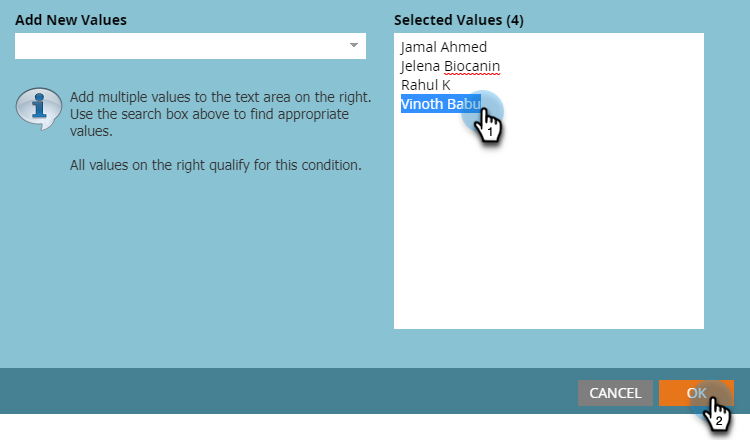

# Gerenciamento de usuários e licenças {#user-and-license-management}

Saiba como adicionar e remover usuários, além de visualizar suas licenças atuais.

## Adicionar um usuário {#add-a-user}

1. Vá para a **Admin** área.

   

1. Clique em **Webinars interativos**.

   

1. Clique em **Adicionar/Remover Usuários**.

   

1. Clique na lista suspensa Usuários disponíveis, selecione o(s) usuário(s) que deseja adicionar e clique em **OK**.

   

## Remover um usuário {#remove-a-user}

1. Vá para a **Admin** área.

   

1. Clique em **Webinars interativos**.

   

1. Clique em **Adicionar/Remover Usuários**.

   

1. Realce o(s) usuário(s) que deseja remover e pressione a tecla Delete. Clique em **OK** quando terminar.

   

## Uso da licença {#license-usage}

Webinars interativos oferecem licenças específicas para criar eventos viabilizados pelo Adobe Connect. Toda vez que uma licença é adicionada, uma nova caixa de uso de licença será exibida. Os administradores do Marketo podem visualizar (não editar) as licenças seguindo as etapas abaixo. Entre em contato com a equipe de conta do Adobe (seu gerente de conta) para obter licenças adicionais.

1. Vá para a **Admin** área.

   

1. Clique em **Webinars interativos**.

   

1. Role para baixo até o(s) cartão(ões) de Uso de licença.

   

<table> 
  <tr> 
   <td><b>Data de início</b></td>
   <td>Data de início da licença.</td>
  </tr>
  <tr> 
   <td><b>Data de validade</b></td>
   <td>Data de expiração da licença.</td>
  </tr>
  <tr> 
   <td><b>Tipo</b></td>
   <td>O tipo de licença adquirida. Há três tipos disponíveis: Licença de eventos compartilhados, Licença de salas compartilhadas, Licença de armazenamento adicional.</td>
  </tr>
  <tr> 
   <td><b>Capacidade do evento</b></td>
   <td>O número máximo de participantes que podem ser acomodados em um evento.</td>
  </tr>
  <tr> 
   <td><b>Total de eventos</b></td>
   <td>O número total de eventos que foram provisionados com esta licença.</td>
  </tr>
  <tr> 
   <td><b>Eventos Consumidos</b></td>
   <td>O número total de eventos concluídos.</td>
  </tr>
  <tr> 
   <td><b>Capacidade de armazenamento</b></td>
   <td>Quantidade de armazenamento disponível para armazenar gravações, material de apoio, heros images, documentação e outros ativos.</td>
  </tr>
  </tbody>
</table>

**Itens a Observar**

* O tipo &quot;Licença de armazenamento adicional&quot; apenas fornece armazenamento, portanto, o valor em cada campo _além_ A capacidade de armazenamento será listada simplesmente como &quot;-&quot;.

* O tipo &quot;Licença de quarto compartilhado&quot; tem eventos ilimitados e &quot;Licença de armazenamento adicional&quot; apenas fornece armazenamento, portanto, o campo Total de eventos para essas licenças será listado simplesmente como &quot;-&quot;.

* Toda vez que um evento for criado, ele contará como &quot;consumido&quot; de sua respectiva licença (a menos que seja uma Licença de sala compartilhada). Será dada preferência à &quot;Licença de evento compartilhado&quot; se houver a &quot;Licença de evento compartilhado&quot; e a &quot;Licença de quarto compartilhado&quot; com a mesma capacidade. Se o evento não tiver sido entregue e o Programa de evento for excluído antes do horário agendado, a contagem de eventos será reposta subtraindo-se um evento de Eventos consumidos.

* Depois que uma licença for esgotada, seu bloco permanecerá na tela Webinars interativos na seção de Administrador com &quot;Total de eventos&quot; e &quot;Eventos consumidos&quot; tendo o mesmo valor. Somente quando a licença expirar ela será removida da tela.

## Acesso de usuário {#user-access}

Os Webinars interativos têm a funcionalidade de regular o uso, dando permissões aos usuários do Marketo Engage para criar e fornecer Webinars interativos. No entanto, um usuário do Webinar interativo (ou não usuário) ainda poderia ter acesso de leitura/edição aos programas de eventos de Webinars interativos criados por outros usuários.

Os usuários do Marketo que receberam permissões de Webinars interativos e são proprietários de um Programa de evento de Webinars interativos específico poderiam executar todas as funções do Webinar interativo relacionadas a esse programa. Isso inclui: criar, acessar, modificar, clonar, mover e excluir esse programa. No entanto, uma vez que esse usuário não é mais um usuário de webinário interativo, o proprietário do programa poderá acessar e mover o programa, mas não executar outras funções.

Usuários do Marketo que receberam permissões de webinários interativos e que _não_ os proprietários de um Programa de evento de webinários interativos específico poderiam executar funções limitadas nesses programas. Os usuários não administradores do Marketo poderão acessar e clonar o programa, mas não poderão executar outras funções se tiverem permissões para Webinars interativos. No entanto, os usuários administradores do Marketo _irá_ ser capaz de executar todas as funções, como acessar, modificar, clonar, mover e excluir esse programa (desde que tenham permissões para Webinars interativos). Quando essa permissão for revogada para usuários administradores e não administradores do Marketo, eles poderão acessar somente o Programa de evento de webinário interativo e não poderão executar outras funções.

A restrição de funções acionáveis seria indicada por um botão de ação esmaecido e uma mensagem de mouse. Alguns exemplos dos botões de ação esmaecidos são &quot;Projetar o webinário&quot; ou &quot;Inserir o webinário&quot;. Para funções não acionáveis, será fornecida uma mensagem destacando as restrições. Veja o exemplo abaixo:

