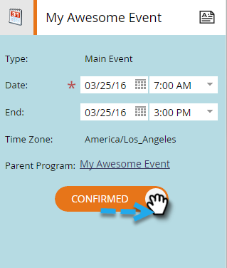

# Criar um novo programa de evento {#create-a-new-event-program}

Eventos permitem automatizar eventos online e offline. Registre o status dos seus funcionários à medida que eles avançam por diferentes estágios e obtenha medidas precisas do ROI para suas iniciativas de marketing.

1. Vá para **[!UICONTROL Atividades de marketing]**.

   

1. Selecione a pasta do novo programa. Selecione **[!UICONTROL Novo]** e clique em **[!UICONTROL Novo programa]**.

   

1. Escolha um nome para o evento. Em seguida, em **[!UICONTROL Tipo de programa]**, selecione **[!UICONTROL Evento]**.

   

1. Selecione um **[!UICONTROL Canal]**.

   >[!NOTE]
   >
   >Os canais definem os diferentes status que uma pessoa pode ter em um programa. Saiba mais sobre a [associação ao programa](/help/marketo/product-docs/core-marketo-concepts/programs/creating-programs/understanding-program-membership.md) aqui.

   

1. Clique em **[!UICONTROL Criar]**.

   

   Ta-da! O novo evento agora aparecerá na árvore.

   

1. Para agendar seu evento, selecione **[!UICONTROL Exibição Agendada]** e clique nele no calendário para abrir o pop-up. Insira datas e horas.

   

1. Deslize a barra para **[!UICONTROL Confirmado]** quando terminar.

   

Depois que o evento for criado, crie as [páginas de aterrissagem](/help/marketo/product-docs/demand-generation/landing-pages/free-form-landing-pages/create-a-free-form-landing-page.md), [formulários](/help/marketo/product-docs/demand-generation/forms/creating-a-form/create-a-form.md) e [emails](/help/marketo/product-docs/email-marketing/email-programs/creating-an-email-program/create-an-email-program.md) para convidar os convidados! Familiarize-se também com a [exibição do cronograma do programa](https://docs.marketo.com/display/docs/program+schedule+view).

>[!MORELIKETHIS]
>
>* [Calendário de marketing](/help/marketo/product-docs/core-marketo-concepts/marketing-calendar/understanding-the-calendar/navigating-the-marketing-calendar.md)
>* [Usando Custos do Período em um Programa](/help/marketo/product-docs/core-marketo-concepts/programs/working-with-programs/using-period-costs-in-a-program.md)
