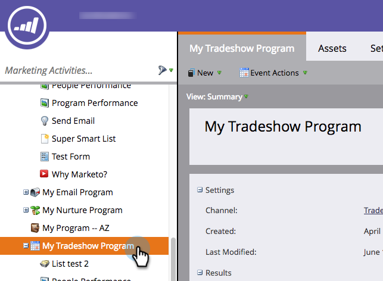

# Editar um canal de evento {#edit-an-event-channel}

Você pode editar o tipo de canal na guia **Resumo** do evento ou na guia **Configuração**.

>[!NOTE]
>
>Essa opção só está disponível para eventos que não têm membros associados. Depois que um evento tiver membros, não será possível alterar o tipo de canal.

>[!NOTE]
>
>Um programa é uma iniciativa de marketing específica. O **canal** deve ser o mecanismo de entrega, como um webinário, uma feira de negócios ou um anúncio online. Você pode ver diferentes opções de canal no menu suspenso, dependendo do que está disponível em sua própria instância. Você também pode [criar seu próprio canal](/help/marketo/product-docs/administration/tags/create-a-program-channel.md).

## Na guia Summary {#from-the-summary-tab}

1. Em **[!UICONTROL Atividades de marketing]**, selecione seu evento na árvore.

   

1. Navegue até a exibição **[!UICONTROL Resumo]**.

   

1. Na categoria **[!UICONTROL Configurações]**, selecione o **[!UICONTROL Canal]** atual exibido como um hiperlink.

   

1. Na lista suspensa, selecione um novo **[!UICONTROL Canal]**.

   

1. Clique em **[!UICONTROL Salvar]**.

   

## Na guia Configuração {#from-the-setup-tab}

Um novo tipo de canal também pode ser atribuído na guia **[!UICONTROL Configuração]** do evento.

1. Selecione o evento na árvore.

   

1. Navegue até a guia **[!UICONTROL Configuração]**. Clique duas vezes no **Canal** atual.

   

1. Selecione um novo **[!UICONTROL Canal]**.

   

1. Clique em **[!UICONTROL Salvar]**.

   

Parabéns! Você acabou de editar um canal!
