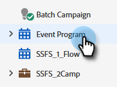

# Configuração de um limite de evento {#setting-an-event-cap}

Limite a quantidade de pessoas que podem se registrar no seu evento com um limite de evento.

>[!NOTE]
>
>Nem todos os clientes têm acesso a esse recurso. Entre em contato com o Gerente de sucesso do cliente para obter detalhes.

>[!IMPORTANT]
>Você deve ter pelo menos duas páginas iniciais aprovadas (uma página de Registro e uma página de Registro Completo) no programa antes de poder definir um limite de evento.

1. Selecione o programa de eventos.

   

1. Na Visão geral, localize [!UICONTROL Cap do Evento] e clique em **[!UICONTROL Não definido]**.

   

1. Insira a quantidade máxima de pessoas que você deseja registrar para o seu evento e clique em **[!UICONTROL Próximo]**.

   

1. Clique no botão [!UICONTROL Página de registro] e selecione a landing page que atuará como a página de registro.

   

1. Clique no botão **[!UICONTROL Página completa do registro]** e selecione a landing page que atuará como a página cheia do registro. Clique em **[!UICONTROL Definir e ativar]** quando concluído.

   

   Está tudo pronto. Se você decidir que deseja editar os detalhes da lista de eventos, clique no texto azul ao lado de [!UICONTROL Cap do Evento].

   
