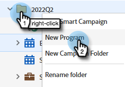

# Definição de Objetivos de Evento {#setting-event-goals}

Atribua metas específicas aos eventos e veja o desempenho deles.

>[!IMPORTANT]
>
>Nem todos compraram este recurso. Entre em contato com a equipe de conta do Adobe (seu gerente de conta) para obter mais detalhes.

1. Criar um programa de evento.

   

1. Escolha a [!UICONTROL Pasta de Campanha], dê ao seu evento um [!UICONTROL Nome], selecione o [!UICONTROL Tipo de Programa] e o [!UICONTROL Canal]. Clique em **[!UICONTROL Criar]** quando terminar.

   

1. Em seu evento, clique na guia **[!UICONTROL Relatórios]**.

   

1. Insira a meta para [!UICONTROL Registrado] clicando em **[!UICONTROL Definir uma meta]**. Digite o número em e pressione Enter.

   

   

1. Repita as mesmas etapas para [!UICONTROL Participou].

   

>[!NOTE]
>
>Você não pode definir metas para um evento após seu início.

E é isso! Verifique o status da meta do evento clicando na guia [!UICONTROL Relatórios].
