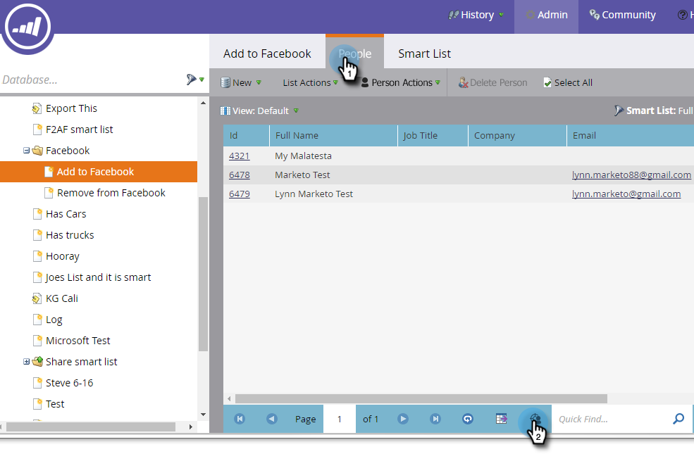

# Criar uma Audiência personalizada no Facebook {#create-a-custom-audience-in-facebook}

>[!PREREQUISITES]
>
>* [Adicione Audiências personalizadas do Facebook como um Serviço](../../../product-docs/demand-generation/ad-network-integrations/add-facebook-custom-audiences-as-a-launchpoint-service.md) LaunchPoint na seção Admin.
>* [Aceite os termos](https://www.facebook.com/ads/manage/customaudiences/tos.php) de Audiências personalizadas do Facebook em sua conta do Facebook.

>

>[!TIP]
>
>Saiba mais sobre audiências [personalizadas no Facebook](https://www.facebook.com/help/341425252616329).

1. Localize e selecione a lista inteligente ou estática que contém os clientes potenciais dos quais você deseja criar a audiência.

   

1. Selecione a guia **Clientes potenciais** e clique no ícone **Enviar por ponte de anúncio **na parte inferior.

   

1. Selecione **Facebook **e clique em **Avançar**.

   

1. Clique no menu suspenso **Audiência** e selecione **+ Nova Audiência**.

   

1. Digite um Nome de **Audiência**. Clique em **Atualizar**.

   

   >[!NOTE]
   >
   >Se você tiver várias contas de anúncio do Facebook, verá uma lista suspensa adicional, permitindo que você escolha em qual conta de anúncio esta audiência foi criada.

   >[!TIP]
   >
   >Deseja trocar uma nova audiência por uma existente que esteja atualmente associada a um conjunto de anúncios ou grupo? Marque a caixa de seleção **Substituir uma audiência** existente. Isso **não** excluirá a audiência que está sendo substituída.

1. Quando concluído, a caixa de diálogo de status será atualizada.

   

   E é isso! No Facebook, você verá a nova audiência no Gerenciador de **anúncios > Audiência**.

   

   >[!NOTE]
   >
   >Todas as listas que você envia para o Facebook se tornam estáticas. As listas inteligentes no Marketo não atualizarão automaticamente a lista de audiência no Facebook para refletir quaisquer alterações feitas após a transferência.

   >[!TIP]
   >
   >Consulte o caminho de aprendizado do [Facebook para clientes](https://facebook.exceedlms.com/student/enrollments/create_enrollment_from_token/BF9TqSaCvM73PP4ScjhCm4fi)do Marketing. Ele abrange tudo o que você precisa saber, desde a criação de uma página do Facebook até a definição de metas para seus anúncios do Facebook usando integrações de rede de anúncios do Marketo.

   >[!NOTE]
   >
   >**Artigos relacionados**
   >
   >    
   >    
   >    * [Adicionar clientes em potencial a uma Audiência personalizada no Facebook](add-leads-to-a-custom-audience-in-facebook.md)

