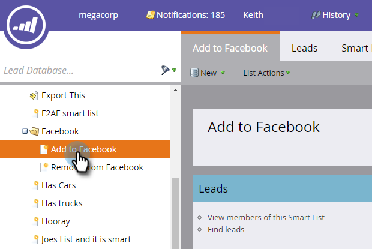
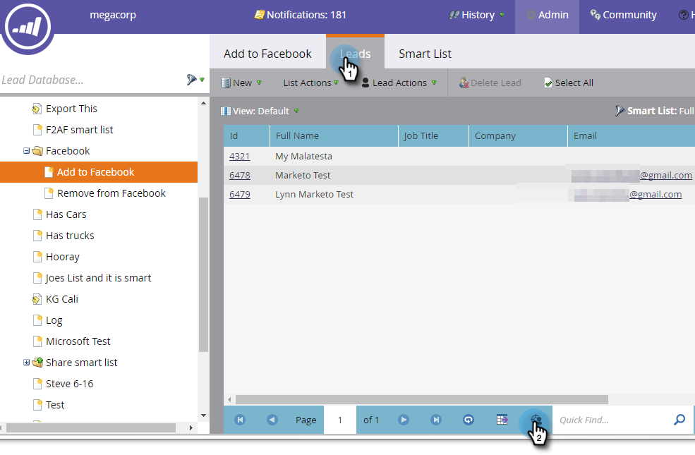
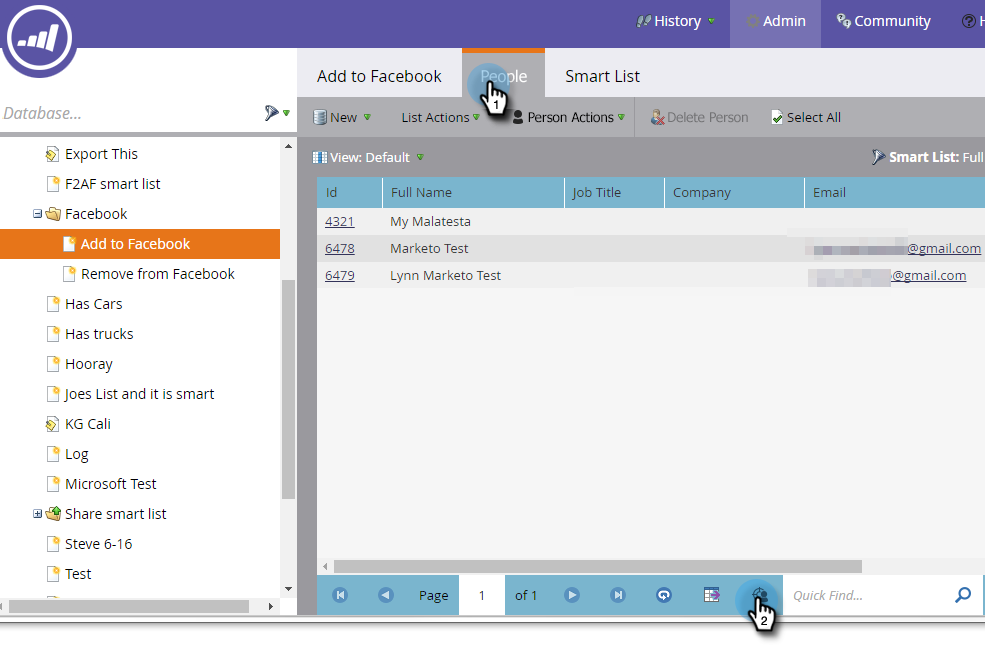
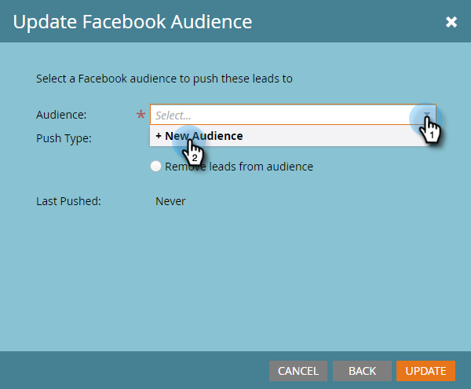
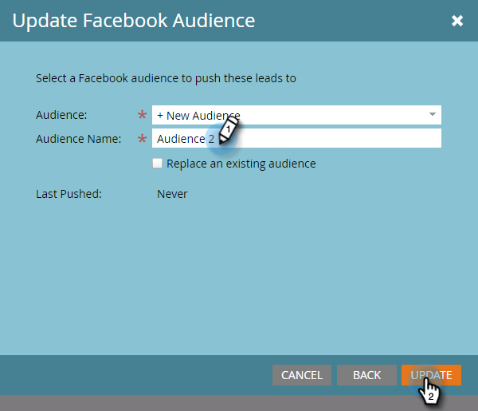
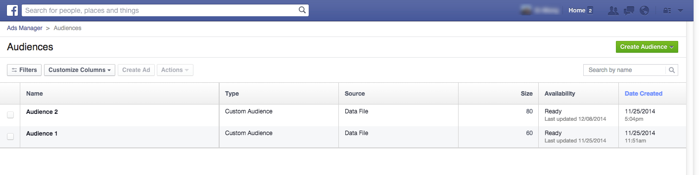

# Criar um Público-alvo Personalizado em [!DNL Facebook] {#create-a-custom-audience-in-facebook}

>[!PREREQUISITES]
>
>* [Adicionar [!DNL Facebook] Públicos-alvo personalizados como um Serviço do LaunchPoint](/help/marketo/product-docs/demand-generation/ad-network-integrations/add-facebook-custom-audiences-as-a-launchpoint-service.md){target="_blank"} na seção de Administrador.
>* [Aceite os Termos de Públicos-alvo personalizados](https://www.facebook.com/ads/manage/customaudiences/tos.php){target="_blank"} do  [!DNL Facebook] na sua conta do [!DNL Facebook].

>[!TIP]
>
>Saiba mais sobre [públicos-alvo personalizados em [!DNL Facebook]](https://www.facebook.com/help/341425252616329){target="_blank"}.

1. Localize e selecione a lista inteligente ou estática que contém os leads dos quais você deseja criar o público-alvo.

   

1. Selecione a guia **[!UICONTROL Clientes Potenciais]** e clique no ícone **Enviar por meio de anúncio Bridge** na parte inferior.

   

1. Selecione **[!UICONTROL Facebook]** e clique em **[!UICONTROL Avançar]**.

   

1. Clique no menu suspenso **[!UICONTROL Público-alvo]** e selecione **[!UICONTROL + Novo Público-alvo]**.

   

   >[!IMPORTANT]
   >
   >A API do Facebook permite até 500 públicos-alvo personalizados por conta de anúncio do Facebook.

1. Digite um **[!UICONTROL Nome de público-alvo]**. Clique em **[!UICONTROL Atualizar]**.

   

   >[!NOTE]
   >
   >Se você tiver várias Contas publicitárias [!DNL Facebook], verá uma lista suspensa adicional, que permite escolher em qual Conta publicitária esse público-alvo será criado.

   >[!TIP]
   >
   >Para trocar um novo público por um público existente que esteja associado a um conjunto ou grupo de anúncios, marque a caixa de seleção **[!UICONTROL Substituir um público existente]**. Isso **não** excluirá o público-alvo que está sendo substituído.

1. Quando terminar, a caixa de diálogo de status será atualizada.

   

   No Facebook, você verá o novo público em **Ads Manager** > **Audiences**.

   

   >[!NOTE]
   >
   >Todas as listas que você enviar por push para [!DNL Facebook] se tornam estáticas. As listas inteligentes no Marketo não atualizarão automaticamente a lista de públicos-alvo em [!DNL Facebook] para refletir quaisquer alterações feitas após a transferência.

   >[!MORELIKETHIS]
   >
   >[Adicionar clientes em potencial a um público-alvo personalizado em [!DNL Facebook]](/help/marketo/product-docs/demand-generation/facebook/add-leads-to-a-custom-audience-in-facebook.md)
