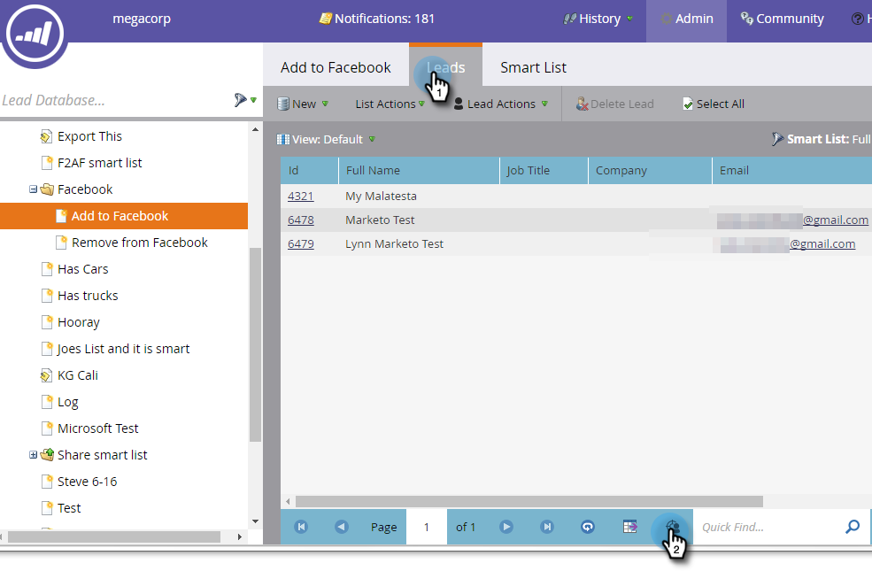

# Criar um público-alvo personalizado no Facebook {#create-a-custom-audience-in-facebook}

>[!PREREQUISITES]
>
>* [Adicionar públicos-alvo personalizados do Facebook como um serviço do LaunchPoint](/help/marketo/product-docs/demand-generation/ad-network-integrations/add-facebook-custom-audiences-as-a-launchpoint-service.md) na seção Admin .
>* [Aceite os termos de públicos-alvo personalizados do Facebook](https://www.facebook.com/ads/manage/customaudiences/tos.php) na sua conta do Facebook.
>

>[!TIP]
>
>Saiba mais sobre [públicos-alvo personalizados no Facebook](https://www.facebook.com/help/341425252616329).

1. Encontre e selecione a lista inteligente ou estática que contém os leads dos quais você deseja criar o público-alvo.

   

1. Selecione o **Clientes potenciais** e, em seguida, clique na guia **Enviar via Ad Bridge** na parte inferior.

   

1. Selecionar **Facebook** e clique em **Próximo**.

   

1. Clique no botão **Público** e selecione **+ Novo público-alvo**.

   

1. Digite um **Nome do público-alvo**. Clique em **Atualizar**.

   

   >[!NOTE]
   >
   >Caso tenha várias contas de anúncios do Facebook, você verá uma lista suspensa adicional, permitindo escolher em qual conta de anúncio esse público-alvo será criado.

   >[!TIP]
   >
   >Deseja trocar um novo público-alvo por um existente que está associado a um conjunto de anúncios ou grupo? Selecione o **Substituir um público-alvo existente** caixa de seleção. Isso fará **not** exclua o público-alvo que está sendo substituído.

1. Quando terminar, a caixa de diálogo de status será atualizada.

   

   E é isso! No Facebook, você verá o novo público-alvo em **Gerenciador de anúncios > Públicos-alvo**.

   

   >[!NOTE]
   >
   >Todas as listas que você envia por push para o Facebook se tornam estáticas. As listas inteligentes no Marketo não atualizarão automaticamente a lista de públicos no Facebook para refletir as alterações feitas após a transferência.

   >[!TIP]
   >
   >Consulte a [Caminho de aprendizagem do facebook para clientes do Marketo](https://facebook.exceedlms.com/student/enrollments/create_enrollment_from_token/BF9TqSaCvM73PP4ScjhCm4fi). Ela aborda tudo o que você precisa saber, desde a criação de uma página do Facebook até o direcionamento de seus anúncios do Facebook usando integrações de rede de anúncios do Marketo.

   >[!NOTE]
   >
   >[Adicionar leads a um público-alvo personalizado no Facebook](/help/marketo/product-docs/demand-generation/facebook/add-leads-to-a-custom-audience-in-facebook.md)
