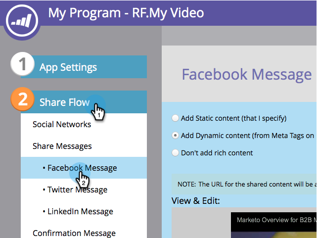

# Editar configurações de publicação avançada do Facebook {#edit-facebook-rich-post-settings}

Personalize publicações quando as pessoas compartilharem você no Facebook.

>[!AVAILABILITY]
>
>Nem todos os usuários do Marketo Engage compraram essa funcionalidade. Entre em contato com a equipe de conta do Adobe (seu gerente de conta) para obter mais detalhes.

Marketo [aplicativos sociais](/help/marketo/product-docs/demand-generation/social/social-functions/add-a-social-button-on-a-landing-page.md) permitir que seus clientes em potencial compartilhem suas páginas de aterrissagem com as conexões deles em redes sociais, como Facebook, Twitter etc. As tags do facebook OpenGraph (tags OG) permitem especificar quais informações da página de aterrissagem são incluídas em publicações do Facebook.

## Selecionar opções de publicação avançadas {#select-rich-post-options}

Você pode especificar os tipos de informações de página a serem usados nas publicações avançadas do Facebook geradas por compartilhamentos da sua página de aterrissagem.

1. Selecionar **Mensagem do facebook** no editor do seu **YouTube** vídeo ou botão social.

   

1. Selecione entre as seguintes opções para a mensagem do Facebook.

   * Adicionar conteúdo estático: selecione essa opção para inserir o título, a legenda e a descrição manualmente.

   

   * Adicionar conteúdo dinâmico: seu aplicativo social pode usar a da sua landing page `<TITLE>`, `<CAPTION>`, e `<DESCRIPTION>` para preencher sua publicação avançada.

   

   >[!NOTE]
   >
   >Eles já devem existir na fonte da página, mas, para obter mais controle, é possível adicionar tags OG da Facebook específicas à página de aterrissagem.

   * Não adicionar conteúdo avançado: limita as publicações do Facebook da página de aterrissagem somente à mensagem e ao link principais.

   

## Adicionar tags OG da Facebook a uma página de aterrissagem {#add-facebook-og-tags-to-a-landing-page}

Para controlar os elementos de página que serão incluídos nos compartilhamentos da Facebook a partir da página de aterrissagem, é possível adicionar tags OG (Open Graph) da Facebook para título, legenda e descrição à página de aterrissagem.

1. Abra a landing page que contém seu **Vídeo do YouTube** ou social.

   

   A variável **Designer de landing page** abre em uma nova janela.

1. Selecionar **Ações da landing page** > **Editar metatags de página**.

   

1. Adicione o HTML que define og:title, og:caption e og:description. Copie e cole essas linhas e substitua o texto do espaço reservado:

   `<meta property="og:title" content="My Post Title"/>`

   `<meta property="og:caption" content="My Post Caption"/>`

   `<meta property="og:description" content="This text appears in the post description"/>`

   

>[!NOTE]
>
>Tenha cuidado para usar a sintaxe de HTML adequada ao adicionar as tags OG.
