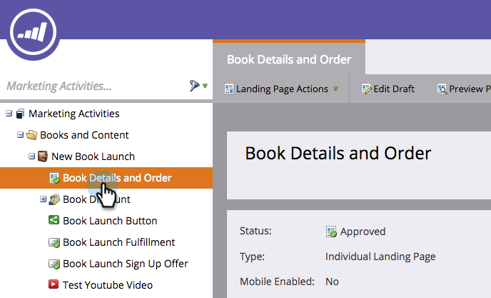
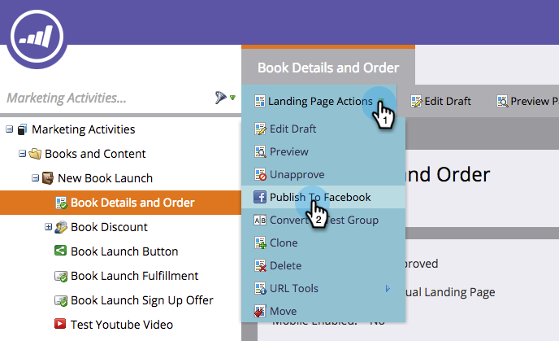
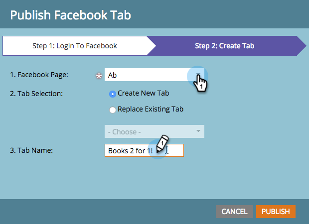

# Publicar páginas de aterrissagem em [!DNL Facebook] {#publish-landing-pages-to-facebook}

Você pode publicar suas páginas de aterrissagem no [!DNL Facebook], encontrar seu público-alvo onde eles já estejam e gerar mais tráfego para seus programas.

>[!AVAILABILITY]
>
>SMB Spark, Padrão e Selecionar. Empresa com recurso licenciado separadamente.

>[!PREREQUISITES]
>
>Sua página deve ter pelo menos 2.000 curtidas antes que você possa publicar no [!DNL Facebook].

Se você estiver lançando um novo livro, poderá alcançar alguns de seus públicos-alvo via email e site. A publicação de uma página de aterrissagem do Marketo, além da sua Página da Marca [!DNL Facebook], alcança um público maior e incentiva o compartilhamento da sua oferta.

1. Selecione uma landing page aprovada.

   

1. Selecione **[!UICONTROL Publicar no Facebook]** em Ações da página de aterrissagem.

   

   >[!NOTE]
   >
   >Essa técnica publica a página de aterrissagem em um aplicativo do [!DNL Facebook] (conhecido anteriormente como guia [!DNL Facebook]). Como os aplicativos do [!DNL Facebook] não estão disponíveis no celular, essa técnica não funcionará quando o visitante tentar acessar a página de aterrissagem publicada em um aplicativo do [!DNL Facebook] em um dispositivo móvel.

1. Autorize o Marketo a publicar na sua página [!DNL Facebook].

   

1. Insira suas credenciais do [!DNL Facebook].

   

   >[!NOTE]
   >
   >Será necessário usar uma conta que tenha permissões de administrador para a página [!DNL Facebook] na qual você deseja publicar sua página de aterrissagem do Marketo.

1. Selecione a **[!UICONTROL Página do Facebook]** onde deseja publicar a página de aterrissagem e digite o nome pelo qual a sua página de aterrissagem do Marketo deve aparecer lá.

   

   >[!NOTE]
   >
   >Para substituir as páginas de aterrissagem do Marketo publicadas anteriormente em [!DNL Facebook], selecione **[!UICONTROL Substituir Guia Existente]** e escolha a guia a ser substituída na lista suspensa. Observe que isso não substituirá guias que não sejam da Marketo.

1. Os clientes em potencial agora podem visitar sua página de aterrissagem diretamente na sua página [!DNL Facebook]. Clique no nome da guia sob a imagem da capa.

   

   >[!NOTE]
   >
   >Para remover a página de aterrissagem de [!DNL Facebook], cancele a aprovação no Marketo e, quando solicitado, selecione a opção para remover a guia [!DNL Facebook].
