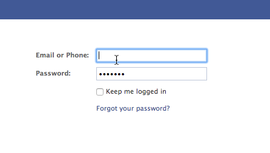

# Publicar páginas de aterrissagem no Facebook {#publish-landing-pages-to-facebook}

Você pode publicar suas landing pages no Facebook, conhecer seu público-alvo, onde já estão e gerar mais tráfego para seus programas.

>[!AVAILABILITY]
>
>SMB Spark, Standard e Select. Enterprise com recurso licenciado separadamente.

>[!PREREQUISITES]
>
>Sua página deve ter pelo menos 2.000 curtidas antes de poder publicar no Facebook.

Caso esteja lançando um novo livro, você pode alcançar algum de seu público via email e site. Publicar uma página de aterrissagem do Marketo também na sua Página da Marca da Facebook atinge um público maior e estimula o compartilhamento de sua oferta.

1. Selecione uma landing page aprovada.

   

1. Selecionar **Publicar no Facebook** em Ações da página inicial.

   

   >[!NOTE]
   >
   >Essa técnica publica a landing page em um aplicativo do Facebook (anteriormente conhecido como Facebook Tab). Como os aplicativos Facebook não estão disponíveis em dispositivos móveis, essa técnica não funcionará quando o visitante tentar acessar sua página de aterrissagem publicada em um aplicativo Facebook em um dispositivo móvel.

1. Autorize o Marketo a publicar na sua página do Facebook.

   

1. Insira suas credenciais do Facebook.

   

   >[!NOTE]
   >
   >Você precisará usar uma conta que tenha permissões de administrador para a página do Facebook na qual deseja publicar sua página de aterrissagem do Marketo.

1. Selecione o **Página do facebook** onde deseja publicar a landing page e inserir o nome pelo qual a landing page do Marketo deve aparecer.

   

   >[!NOTE]
   >
   >Para substituir as landing pages do Marketo publicadas anteriormente no Facebook, selecione **Substituir guia existente** e escolha a guia a ser substituída na lista suspensa. Observe que isso não substituirá guias que não sejam Marketo.

1. Agora os leads podem visitar sua página de aterrissagem diretamente na sua página do Facebook. Basta clicar no nome da guia abaixo da imagem da capa.

   

   >[!NOTE]
   >
   >Para remover a landing page do Facebook, cancele a aprovação no Marketo e, quando solicitado, selecione a opção para remover a guia do Facebook.
