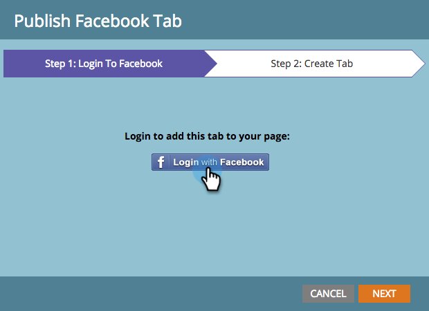

# Páginas de aterrissagem do Publish para o Facebook {#publish-landing-pages-to-facebook}

Você pode publicar suas páginas de aterrissagem no Facebook, conhecer seu público-alvo onde já estão e gerar mais tráfego para seus programas.

>[!AVAILABILITY]
>
>SMB Spark, Padrão e Selecionar. Empresa com recurso licenciado separadamente.

>[!PREREQUISITES]
>
>Sua página deve ter pelo menos 2.000 curtidas antes de ser possível publicar no Facebook.

Se você estiver lançando um novo livro, poderá alcançar alguns de seus públicos-alvo via email e site. A publicação de uma landing page do Marketo, além da sua página de marca da Facebook, alcança um público maior e incentiva o compartilhamento da sua oferta.

1. Selecione uma landing page aprovada.

   

1. Selecione **Publish para Facebook** em Ações da página de aterrissagem.

   

   >[!NOTE]
   >
   >Essa técnica publica a página de aterrissagem em um aplicativo do Facebook (conhecido anteriormente como guia Facebook). Como os aplicativos Facebook não estão disponíveis em dispositivos móveis, essa técnica não funcionará quando o visitante tentar acessar a landing page publicada em um aplicativo Facebook em um dispositivo móvel.

1. Autorize o Marketo a publicar na sua página do Facebook.

   

1. Insira suas credenciais do Facebook.

   

   >[!NOTE]
   >
   >Será necessário usar uma conta que tenha permissões de administrador para a página do Facebook na qual você deseja publicar sua página de aterrissagem do Marketo.

1. Selecione a **Página do Facebook** onde deseja publicar a página de aterrissagem e digite o nome pelo qual a sua página de aterrissagem do Marketo deve aparecer lá.

   

   >[!NOTE]
   >
   >Para substituir as páginas de aterrissagem do Marketo publicadas anteriormente no Facebook, selecione **Substituir guia existente** e escolha a guia a ser substituída na lista suspensa. Observe que isso não substituirá guias que não sejam da Marketo.

1. Os clientes potenciais agora podem visitar sua página de aterrissagem diretamente em sua página do Facebook. Basta clicar no nome da guia abaixo da imagem da Capa.

   

   >[!NOTE]
   >
   >Para remover a landing page do Facebook, cancele a aprovação no Marketo e, quando solicitado, selecione a opção para remover a guia do Facebook.
