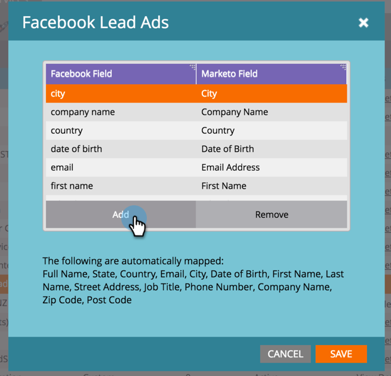

# Mapear campos personalizados para o Marketo {#map-custom-fields-to-marketo}

Você pode coletar mais do que as informações padrão armazenadas por padrão [!DNL Facebook], como a frequência com que alguém usa seu serviço de entrega online. Você pode fazer isso [criando perguntas personalizadas](https://www.facebook.com/business/help/774623835981457?helpref=uf_permalink) nos seus [!DNL Facebook] anúncios de cliente potencial.

No entanto, o **Marketo não iniciará automaticamente a coleta desses dados**. Para que o Marketo comece a capturar valores de campos personalizados, você **deve** mapear esses campos personalizados para um campo no Marketo.

Veja como configurar isso na área LaunchPoint do Administrador.

>[!NOTE]
>
>**Permissões de administrador necessárias**

1. Vá para a área de Administração e clique em **[!UICONTROL LaunchPoint]**. Em Serviços Instalados, localize e edite os **[!UICONTROL Anúncios de Cliente Potencial do Facebook]**.

   

1. Clique em **[!UICONTROL Avançar]**.

   

1. Deixe a conta autorizada como está. **não** faça alterações. Clique em **[!UICONTROL Avançar]**.

   

1. Como antes, deixe as páginas selecionadas como estão. **não** faça alterações. Clique em **[!UICONTROL Avançar]**.

   

1. Aqui é onde você mapeia o campo personalizado [!DNL Facebook] para seu campo do Marketo. Clique em **[!UICONTROL Adicionar].**

   

1. Na nova linha, digite o nome do campo personalizado [!DNL Facebook].

   

   >[!NOTE]
   >
   >Somente os campos que foram salvos em [!DNL Facebook] modelos de formulário aparecerão como opções aqui.

1. Clique na coluna **[!UICONTROL Campo do Marketo]**. Digite para procurar o campo para o qual deseja mapear. Depois de selecionar um campo, clique em **[!UICONTROL Salvar]**.

   

   >[!NOTE]
   >
   >Se você ainda não tiver um campo no Marketo para mapear o campo [!DNL Facebook], saiba como [criar campos personalizados](/help/marketo/product-docs/administration/field-management/create-a-custom-field-in-marketo.md).

>[!CAUTION]
>
>Você **deve** passar por esse processo para qualquer novo campo [!DNL Facebook] para que a Marketo colete os dados.
