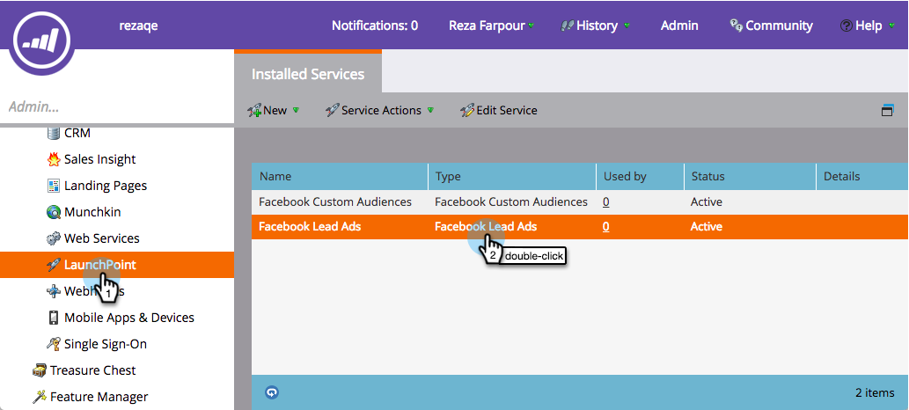
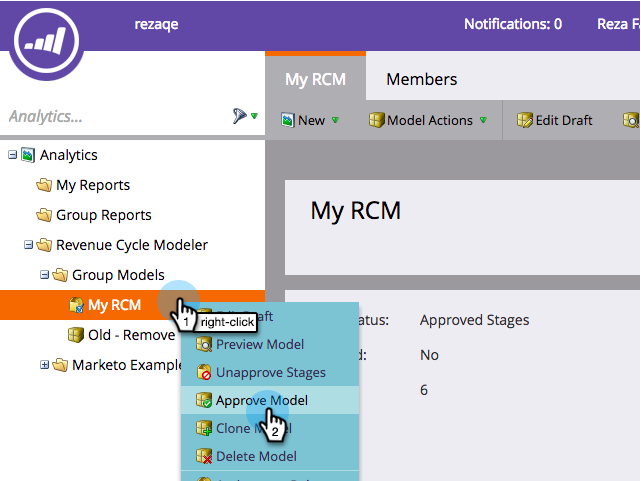

# Configurar [!DNL Facebook] conversões offline {#set-up-facebook-offline-conversions}

Ao enviar de volta os dados de conversão offline para o [!DNL Facebook] para as pessoas criadas com os anúncios de cliente potencial, a sua equipe de publicidade poderá otimizar melhor do que nunca os gastos com anúncios. Veja como configurar isso.

>[!PREREQUISITES]
>
>* Você deve [configurar os anúncios de cliente em potencial do Facebook](/help/marketo/product-docs/demand-generation/facebook/set-up-facebook-lead-ads.md).
>* Você deve ter um modelo aprovado em [Revenue Cycle Modeler](/help/marketo/product-docs/reporting/revenue-cycle-analytics/revenue-cycle-models/understanding-revenue-models.md).

## Configuração de administração {#admin-configuration}

1. Vá para o **[!UICONTROL Administrador]** do Marketo.

   

1. Vá para **[!UICONTROL LaunchPoint]** e clique duas vezes no serviço Facebook Lead Ads criado anteriormente.

   >[!NOTE]
   >
   >Se você ainda não fez isso, vá em frente e [Configure os [!UICONTROL anúncios de cliente potencial do Facebook]](/help/marketo/product-docs/demand-generation/facebook/set-up-facebook-lead-ads.md) e volte aqui.

   

1. Se desejar, edite o **[!UICONTROL Nome para Exibição]** para incluir Conversões Offline. Clique em **[!UICONTROL Avançar]**.

   

1. Marque **[!UICONTROL Habilitar Conversões Offline]** e clique em **[!UICONTROL Avançar]**.

   

1. Clique em **[!UICONTROL Avançar]**.

   

1. Clique em **[!UICONTROL Salvar]**.

   

   Doce! Você está na metade da habilitação de [!DNL Facebook] Conversões Offline. Vamos passar para o Revenue Cycle Modeler para mapear os estágios.

   

## Configuração do Modeler do ciclo de receita {#revenue-cycle-modeler-configuration}

1. Vá para **[!UICONTROL Analytics]**.

   

1. Selecione seu modelo e clique em **[!UICONTROL Editar rascunho]**.

   

   >[!NOTE]
   >
   >Atualmente, há 10 [!DNL Facebook] eventos para os quais você pode mapear Estágios do ciclo de receita:
   >
   >* Adições de informações de pagamento
   >* Adiciona ao carrinho
   >* Adiciona à lista de desejos
   >* Registros concluídos
   >* Check-outs iniciados
   >* Pessoa
   >* Outro
   >* Adquirir
   >* Pesquisas
   >* Exibições de conteúdo

1. Selecione o estágio que deseja mapear e, no menu suspenso **[!UICONTROL Conversão do Facebook]**, selecione o Evento [!DNL Facebook] para o qual deseja mapeá-lo. Repita esta etapa para mapear todos os estágios no seu RCM para estágios de conversão offline no [!DNL Facebook].

   

1. Quando terminar o mapeamento, feche o modelo.

   

1. Aprove seu modelo e pronto!

   

   Agora, quando os clientes em potencial de anúncio de cliente potencial atingem os estágios mapeados, as conversões são enviadas para [!DNL Facebook] para relatório.

   >[!CAUTION]
   >
   >Verifique sua conta [!DNL Facebook] e certifique-se de que todos os [anúncios estão associados](https://www.facebook.com/business/url/?href=%2Fbusiness%2Fhelp%2Fwww%2F1776828022605281&cmsid&creative=link&creative_detail=advertiser-help-center&create_type&destination_cms_id&orig_http_referrer) ao Conjunto de Eventos de Conversões Offline do Marketo. Se não estiverem, a atribuição de anúncio pode não funcionar.

   >[!NOTE]
   >
   >Os Dados de Conversão Offline são enviados do Marketo para [!DNL Facebook] várias vezes por dia.

>[!MORELIKETHIS]
>
>[Noções Básicas [!DNL Facebook] Das Conversões Offline](/help/marketo/product-docs/demand-generation/facebook/understanding-facebook-offline-conversions.md)
