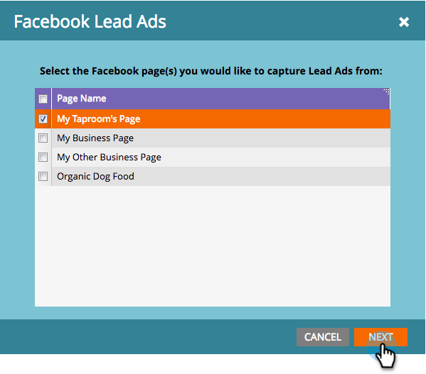

# Configurar conversões offline do Facebook {#set-up-facebook-offline-conversions}

Ao enviar dados de conversão offline de volta ao Facebook para pessoas criadas por meio de Anúncios de venda, sua equipe de publicidade pode otimizar seus gastos com publicidade melhor do que nunca. Veja como configurar.

>[!NOTE]
>
>**Pré-requisitos**
>
>* Você deve [configurar os Anúncios](set-up-facebook-lead-ads.md)de venda do Facebook.
>* Você deve ter um modelo aprovado no [Revenue Cycle Modeler](http://docs.marketo.com/display/docs/revenue+cycle+models).

>

## Configuração do administrador {#admin-configuration}

1. Vá para **Administrador** do Marketo.

   

1. Acesse **LaunchPoint** e clique com o duplo no serviço de Anúncios de venda do Facebook criado anteriormente.

   >[!NOTE]
   >
   >Se você não fez isso, vá em frente e [Configure os Anúncios](set-up-facebook-lead-ads.md)de venda do Facebook, então volte aqui.

   

1. Se desejar, edite o Nome **de** exibição para incluir Conversões off-line. Clique em **Avançar**.

   

1. Marque **Ativar conversões** offline e clique em **Avançar**.

   

1. Clique em **Avançar**.

   

1. Clique em **Salvar**.

   

   Doce! A metade do tempo foi concluída para ativar as Conversões offline do Facebook. Vamos até o Modelador do Ciclo de Receita para mapear os estágios.

   

## Configuração do Modelador do Ciclo de Receita {#revenue-cycle-modeler-configuration}

1. Vá para **Analytics**.

   

1. Selecione o modelo e clique em **Editar rascunho**.

   

   >[!NOTE]
   >
   >Atualmente, existem 10 eventos do Facebook que podem ser mapeados para:
   >
   >    
   >    
   >    * Adiciona informações de pagamento
   >    * Adiciona ao carrinho
   >    * Adiciona à Lista de desejos
   >    * Registros concluídos
   >    * Check-outs iniciados
   >    * Pessoa
   >    * Outros
   >    * Compra
   >    * Pesquisas
   >    * Visualizações de conteúdo

1. Selecione o estágio que deseja mapear e, no menu suspenso Conversão **do** Facebook, selecione o Evento do Facebook para o qual deseja mapear. Repita esta etapa para mapear todos os estágios no RCM para estágios de conversão offline no Facebook.

   

1. Quando terminar de mapear, feche o modelo.

   

1. Aprove seu modelo e você terminou!

   

   Agora, quando o Lead Ad chega aos estágios que você mapeou, as conversões são enviadas para o Facebook para relatórios.

   >[!CAUTION]
   >
   >Verifique sua conta do Facebook e certifique-se de que todos os [anúncios estejam associados](https://www.facebook.com/business/url/?href=%2Fbusiness%2Fhelp%2Fwww%2F1776828022605281&amp;cmsid&amp;creative=link&amp;creative_detail=advertiser-help-center&amp;create_type&amp;destination_cms_id&amp;orig_http_referrer) ao Conjunto de Eventos de Conversões Offline do Marketing. Se não estiverem, a atribuição pode não funcionar.

   >[!NOTE]
   >
   >Os dados de conversão offline são enviados do Marketo para o Facebook várias vezes por dia.

>[!NOTE]
>
>**Artigos relacionados**
>
>* [Compreensão das conversões offline do Facebook](understanding-facebook-offline-conversions.md)

>

