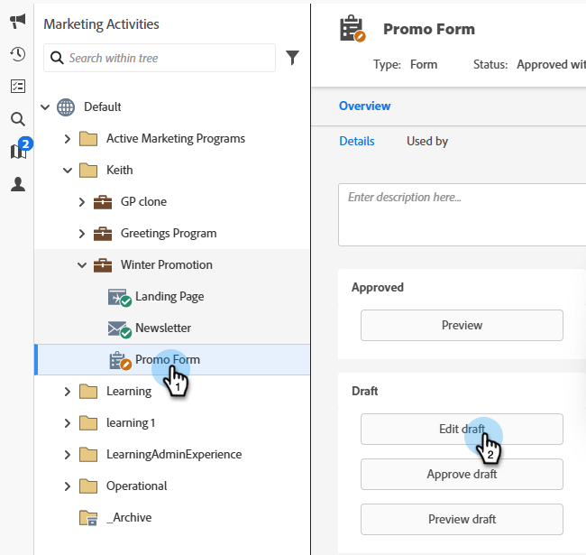

# Adicionar um campo a um formulário {#add-a-field-to-a-form}

Depois de [criar seu formulário](/help/marketo/product-docs/demand-generation/forms/creating-a-form/create-a-form.md){target="_blank"} e [selecionar um tema](/help/marketo/product-docs/demand-generation/forms/creating-a-form/select-a-form-theme.md){target="_blank"}, você pode adicionar outros campos para que as pessoas possam preenchê-los. Veja como.

1. Vá para **[!UICONTROL Atividades de marketing]**.

   

1. Selecione seu formulário e clique em **[!UICONTROL Editar rascunho]**

   

   >[!NOTE]
   >
   >Se o formulário desejado estiver no estado _Aprovado_, clique primeiro em **Criar Rascunho**.

1. No formulário, clique no sinal **+**.

   

   >[!NOTE]
   >
   >Quando você cria um novo formulário, o [!UICONTROL Nome], o [!UICONTROL Sobrenome] e o [!UICONTROL Endereço de email] são adicionados automaticamente.

1. Localize e selecione o campo que deseja adicionar ao formulário.

   

1. Adicione quantos campos forem necessários e clique em **[!UICONTROL Concluir]**.

   

1. Clique em **[!UICONTROL Aprovar e Fechar]**.

   

>[!NOTE]
>
>Certifique-se de aprovar todos os rascunhos de página de aterrissagem criados devido às alterações no formulário.

>[!MORELIKETHIS]
>
>[Tornar um campo de formulário obrigatório](/help/marketo/product-docs/demand-generation/forms/creating-a-form/make-a-form-field-required.md){target="_blank"}
