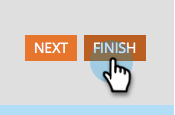

# Aprovar um formulário {#approve-a-form}

Para adicionar um formulário a uma das Landing Pages, ele deve ser aprovado.

## Aprovar um formulário {#approve}

Veja como aprovar um formulário existente pronto para uso.

1. Vá para **[!UICONTROL Atividades de marketing]**.

   

1. Selecione o formulário desejado e clique em **[!UICONTROL Aprovar rascunho]**.

   

   Uma marca de seleção verde é exibida.

   

   Ele foi aprovado e está pronto para ser [adicionado a uma Página de Aterrissagem](/help/marketo/product-docs/demand-generation/landing-pages/understanding-landing-pages/approve-unapprove-or-delete-a-landing-page.md){target="_blank"}.

   >[!NOTE]
   >
   >As alterações feitas após a aprovação podem levar alguns minutos para serem atualizadas em formulários inseridos.

## Aprovar um formulário do editor {#approve-from-the-editor}

Você pode aprovar um formulário diretamente no editor de formulários.

>[!PREREQUISITES]
>
>[Editar um formulário](/help/marketo/product-docs/demand-generation/forms/form-actions/edit-a-form.md)

1. No formulário, clique em **[!UICONTROL Concluir]**.

   

1. Clique em **[!UICONTROL Aprovar e Fechar]**.

   
