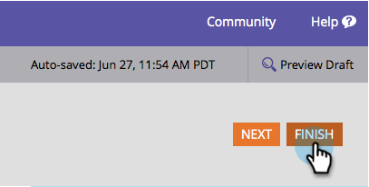

# Editar um rótulo de campo em um formulário {#edit-a-field-label-in-a-form}

Você pode alterar o rótulo em um formulário para qualquer coisa - você pode até usar uma imagem ou apagá-la completamente! Veja como fazer isso.

1. Vá para **[!UICONTROL Atividades de marketing]**.

   

1. Selecione seu formulário e clique em **[!UICONTROL Editar Formulário]**.

   

1. Selecione seu campo e edite o **[!UICONTROL Rótulo]**. Os campos nas Configurações do formulário refletirão os rótulos inseridos.

   

   >[!TIP]
   >
   >Se você quiser se fantasiar, clique no . Isso abrirá um editor de rich text e permitirá que você vá para a cidade com imagens, links e muito mais!

1. Clique em **[!UICONTROL Concluir]**.

   

1. Clique em **[!UICONTROL Aprovar e Fechar]**.

   

>[!NOTE]
>
>Não esqueça de [aprovar o rascunho da página de aterrissagem](/help/marketo/product-docs/demand-generation/landing-pages/understanding-landing-pages/approve-unapprove-or-delete-a-landing-page.md) criado pelas alterações de formulário.

É isso aí! Pouco a pouco você vai se tornando um defensor do design.
