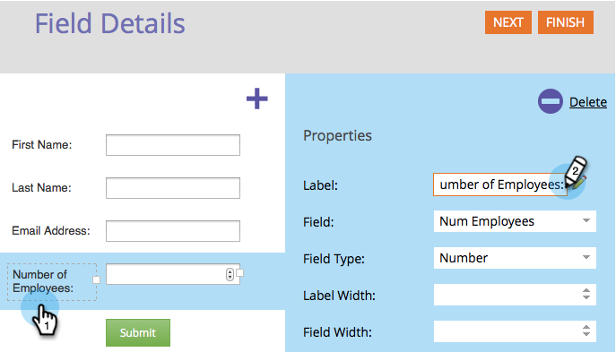
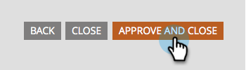

# Editar um rótulo de campo em um formulário {#edit-a-field-label-in-a-form}

Você pode alterar o rótulo em um formulário para qualquer coisa - você pode até usar uma imagem ou apagá-la completamente! Veja como fazer isso.

1. Vá para **[!UICONTROL Atividades de marketing]**.

   

1. Selecione seu formulário e clique em **[!UICONTROL Criar rascunho]**.

   

   >[!NOTE]
   >
   >Se o formulário não for aprovado, clique em **Editar rascunho**.

1. Selecione seu campo e edite o **[!UICONTROL Rótulo]**. Os campos nas Configurações do formulário refletirão os rótulos inseridos.

   

   >[!TIP]
   >
   >Clique no ícone de  para acessar o editor de rich text.

1. Clique em **[!UICONTROL Concluir]**.

   

1. Clique em **[!UICONTROL Aprovar e Fechar]**.

   

>[!NOTE]
>
>Não esqueça de [aprovar o rascunho da Página de Aterrissagem](/help/marketo/product-docs/demand-generation/landing-pages/understanding-landing-pages/approve-unapprove-or-delete-a-landing-page.md){target="_blank"} criado pelas alterações de formulário.
