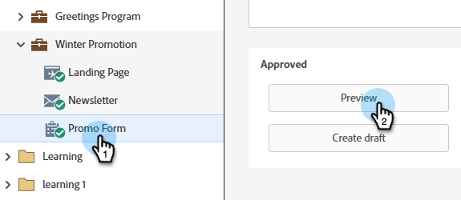

# Pré-visualizar um formulário {#preview-a-form}

Antes de publicar, você pode ver o formulário neste pré-visualizador de formulário.

1. Acesse **[!UICONTROL Atividades de marketing]**.

   

1. Selecione o formulário e clique em **[!UICONTROL Visualizar]**.

   

   >[!NOTE]
   >
   >Se o formulário não for aprovado, clique em **Visualizar rascunho**.

1. O editor de formulários será aberto no modo _visualização_.

   

1. Clique em **[!UICONTROL Editar rascunho]** para voltar para o modo _editar_.

   

1. Retorne facilmente clicando em **[!UICONTROL Visualizar Rascunho]**.

   
