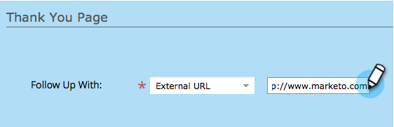

# Definir um formulário de página de agradecimento {#set-a-form-thank-you-page}

O que acontece quando alguém preenche um formulário? Para onde eles são encaminhados? Veja como configurá-lo.

## Editar formulário {#edit-form}

1. Vá para **[!UICONTROL Atividades de marketing]**.

   

1. Selecione seu formulário e clique em **[!UICONTROL Editar Formulário]**.

   

1. Em **[!UICONTROL Configurações de formulário]**, clique em **[!UICONTROL Configurações]**.

   

1. Role para baixo até a seção **[!UICONTROL Página de Agradecimento]**.

## Permanecer na página {#stay-on-page}

A opção Permanecer na página manterá o visitante na mesma página quando o formulário for enviado.

1. Selecione **[!UICONTROL Permanecer na Página]** para **[!UICONTROL Acompanhar Com]**.

   

## URL externa {#external-url}

A configuração External URL permite definir qualquer URL como a página de acompanhamento. Depois que o usuário enviar o formulário, ele será direcionado para a URL especificada.

1. Selecione a **[!UICONTROL URL Externa]** para **[!UICONTROL Acompanhamento]**.

   

1. Insira o URL completo.

   

>[!TIP]
>
>A URL pode ser de um arquivo hospedado em algum lugar. Se você fizer isso, o botão &quot;[!UICONTROL Enviar]&quot; se comportará como um botão &quot;[!UICONTROL Baixar]&quot;.

## Página de destino {#landing-page}

Você pode selecionar qualquer página de aterrissagem aprovada do Marketo como acompanhamento.

1. Defina **[!UICONTROL Acompanhamento]** para **[!UICONTROL Página de Aterrissagem]**.

   

1. Localize e selecione a landing page desejada.

   

## Páginas de agradecimento dinâmicas {#dynamic-thank-you-pages}

Você pode adicionar várias opções e criar opções para mostrar às pessoas diferentes acompanhamentos, dependendo de suas respostas.

1. Clique em **[!UICONTROL Adicionar opção]**.

   

1. Selecione o campo do qual deseja monitorar a resposta.

   

   >[!TIP]
   >
   >Somente os campos adicionados ao formulário estão disponíveis para esta tarefa.

1. Selecione o operador lógico desejado.

   

1. Insira um dos valores com os quais o usuário responderá.

   

1. Escolha a página apropriada para o tipo **[!UICONTROL Acompanhar com]**.

   

1. Selecione a landing page apropriada.

   

   >[!NOTE]
   >
   >Você deve ter criado/aprovado essas landing pages antecipadamente.

1. Clique no sinal **+** para adicionar outra opção.

   

   >[!NOTE]
   >
   >Você pode adicionar várias opções. No entanto, se você adicionar muitos, isso poderá afetar a velocidade de carregamento do formulário, portanto, adicione apenas o que for necessário.

1. Acesse e configure a **[!UICONTROL Opção 2]**.

   

   >[!TIP]
   >
   >Sinta-se à vontade para misturar e combinar tipos de acompanhamento. Você pode usar uma landing page para uma escolha e um URL para outra.

1. Definir uma página padrão para todas as outras respostas.

   

1. Selecione a própria página e clique em **[!UICONTROL Salvar]**.

   

   Ok, parece bom!

   

1. Clique em **[!UICONTROL Concluir]**.

   

1. Clique em **[!UICONTROL Aprovar e Fechar]**.

   

Muito bem!
