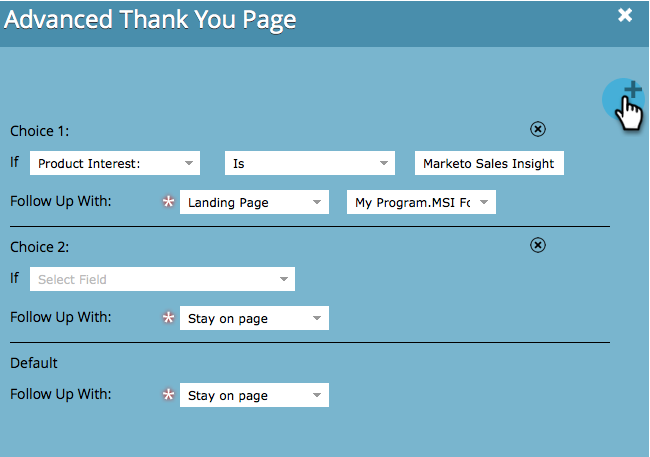

# Definir uma página de agradecimento do formulário {#set-a-form-thank-you-page}

O que acontece quando alguém preenche um formulário? Para onde eles são encaminhados? Aqui está como configurá-lo.

## Editar formulário {#edit-form}

1. Vá para **Atividades de marketing**.

   

1. Selecione o formulário e clique em **Editar formulário**.

   

1. Em **Configurações do formulário**, clique em **Configurações**.

   

1. Role para baixo até a seção **Página de agradecimento**.

## Permanecer na página {#stay-on-page}

A opção Permanecer na página manterá o visitante na mesma página quando o formulário for enviado.

1. Selecione **Permanecer na página** para **Acompanhamento com**.

   

## URL externo {#external-url}

A configuração URL externo permite definir qualquer URL como página de acompanhamento. Depois que o usuário enviar o formulário, ele será direcionado para o URL especificado.

1. Selecione **URL Externo** para **Acompanhamento com**.

   

1. Insira o URL completo.

   

>[!TIP]
>
>O URL pode ser o de um arquivo hospedado em algum lugar. Se você fizer isso, o botão &quot;Enviar&quot; se comportará como um botão &quot;Download&quot;.

## landing page {#landing-page}

Você pode selecionar qualquer landing page de marketing aprovada como acompanhamento.

1. Defina **Seguir com** como **Landing page**.

   

1. Localize e selecione a landing page desejada.

   

## Páginas de agradecimento Dinâmico {#dynamic-thank-you-pages}

Você pode adicionar várias opções e criar opções para mostrar às pessoas diferentes acompanhamentos, dependendo de suas respostas.

1. Clique em **Adicionar Escolha**.

   

1. Selecione o campo do qual deseja monitorar a resposta.

   

   >[!TIP]
   >
   >Somente os campos adicionados ao formulário estão disponíveis para isso.

1. Selecione o operador lógico desejado.

   

1. Insira um dos valores com os quais o usuário responderá.

   

1. Escolha a página apropriada para o tipo **Acompanhamento com**.

   

1. Selecione a landing page apropriada.

   

   >[!NOTE]
   >
   >Você deve ter criado/aprovado essas landings page antecipadamente.

1. Clique no sinal **+** para adicionar outra opção.

   

   >[!NOTE]
   >
   >Você pode adicionar várias opções. No entanto, se você adicionar muitos, isso pode afetar a velocidade de carregamento do formulário, portanto, adicione apenas o que você precisa.

1. Siga em frente e configure **Opção 2**.

   

   >[!TIP]
   >
   >Sinta-se à vontade para combinar tipos de acompanhamento. Você pode usar uma landing page para uma escolha e um URL para outra.

1. Defina uma página padrão para todas as outras respostas.

   

1. Selecione a própria página e clique em **Salvar**.

   

   Ok, parece bom!

   

1. Clique em **Concluir**.

   

1. Clique em **Aprovar e Fechar**.

   

Ótimo trabalho!

