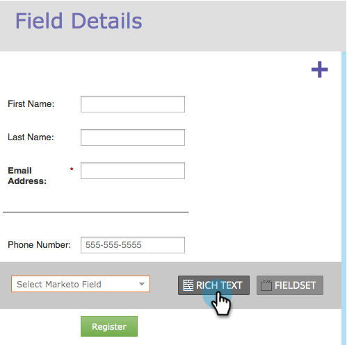
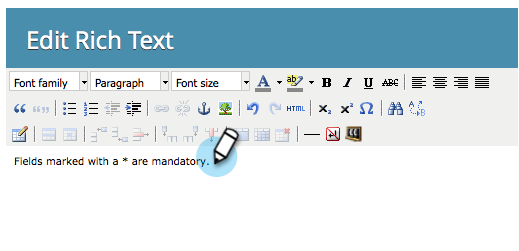

# Adicionar Rich Text a um Formulário {#add-rich-text-to-a-form}

Use Rich Text em um formulário para adicionar instruções ou outras informações entre campos. Dê uma olhada.

1. Vá para **[!UICONTROL Atividades de marketing]**.

   

1. Selecione seu formulário e clique em **[!UICONTROL Editar Formulário]**.

   

1. Clique no sinal **+**.

   

1. Selecione **[!UICONTROL Rich Text]**.

   

1. Insira o texto desejado.

   

   >[!TIP]
   >
   >Se precisar de um separador de linha no formulário, use o botão Linha Horizontal.

1. Clique em **[!UICONTROL Salvar]**.

   

1. Clique em **[!UICONTROL Concluir]**.

   

1. Clique em **[!UICONTROL Aprovar e Fechar]**.

   

   Muito bem! Dê uma olhada.

   

>[!TIP]
>
>Você sabia que também pode [adicionar regras de visibilidade](/help/marketo/product-docs/demand-generation/forms/form-fields/dynamically-toggle-visibility-of-a-form-field.md) a um bloco de rich text?
