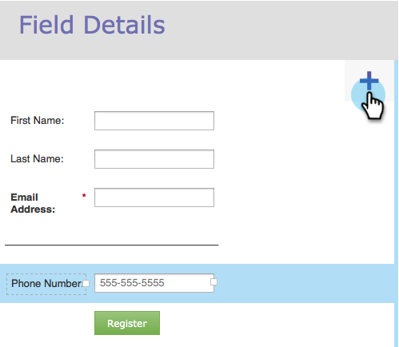

# Adicionar rich text a um formulário {#add-rich-text-to-a-form}

Use Rich Text em um Formulário para adicionar instruções ou outras informações entre campos. Dê uma olhada.

1. Ir para **Atividades de marketing**.

   

1. Selecione o formulário e clique em **Editar formulário**.

   

1. Clique no botão **+** sinal.

   

1. Selecionar **Texto formatado**.

   

1. Insira o texto desejado.

   

   >[!TIP]
   >
   >Se precisar de um separador de linha no formulário, use o botão Linha Horizontal.

1. Clique em **Salvar**.

   

1. Clique em **Concluir**.

   

1. Clique em **Aprovar e fechar**.

   

   Muito bem! Dê uma olhada.

   

>[!TIP]
>
>Você sabia que também pode [adicionar regras de visibilidade](/help/marketo/product-docs/demand-generation/forms/form-fields/dynamically-toggle-visibility-of-a-form-field.md) para um bloco Rich Text?
