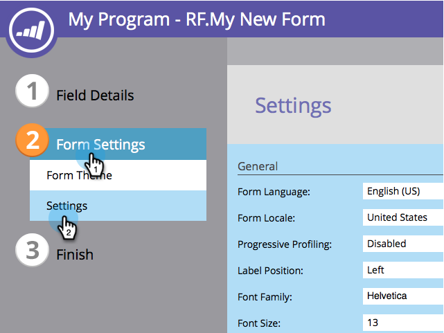

# Alterar a localidade de um formulário {#change-a-forms-locale}

Ao lidar com formulários internacionais, será necessário exibir datas/horas nos formatos corretos. O Marketo fará isso automaticamente para você. Tudo o que você precisa fazer é definir o local do formulário e nós cuidaremos do resto.

1. Acesse **[!UICONTROL Atividades de marketing]**.

   

1. Selecione seu formulário e clique em **[!UICONTROL Editar Formulário]**.

   

1. Em **[!UICONTROL Configurações de formulário]**, clique em **[!UICONTROL Configurações]**.

   

1. Selecione a **[!UICONTROL Localidade do Formulário]** de sua escolha.

   

1. Clique em **[!UICONTROL Concluir]**.

   

1. Clique em **[!UICONTROL Aprovar e Fechar]** para aplicar e salvar as alterações.

   >[!NOTE]
   >
   >O formulário deve ser aprovado para ser usado em landing pages.

   

   >[!NOTE]
   >
   >Lembre-se de [aprovar o rascunho da página de aterrissagem](/help/marketo/product-docs/demand-generation/landing-pages/understanding-landing-pages/approve-unapprove-or-delete-a-landing-page.md) criado pelas alterações de formulário.

   É isso aí! As pessoas podem ver a data/hora sendo exibida no local correto.

   
